# Обнаружение событий с использованием модели 2D CNN локализации

## 1. Назначение метода

Этот документ описывает метод обнаружения сфериков в VLF/Broadband данных с помощью обученной модели:

```text
raw Broadband_Data_*.bin
  -> 2-секундные спектрограммы
  -> 2D CNN
  -> временная heatmap события
  -> peak picking
  -> времена сфериков и число событий
```

Метод отличается от порогового детектора тем, что модель не смотрит только на одномерную огибающую мощности. Она получает двумерную спектрограмму `frequency x time` и учится находить характерный частотно-временной рисунок сферика.

Общая схема применения:

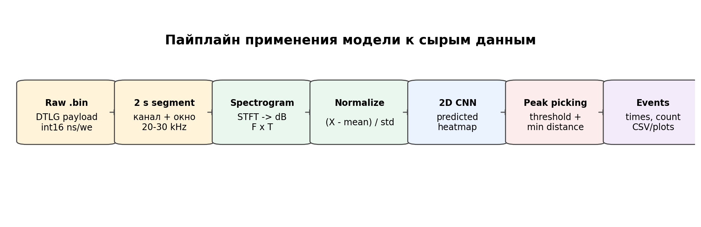

## 2. Что модель считает событием

В текущей задаче событие - это момент времени внутри 2-секундного сегмента, где на спектрограмме виден короткий широкополосный импульс.

Для каждого сегмента есть:

- спектрограмма `spec_db`;
- временная ось `time_axis`;
- частотная ось `freq_axis`;
- ручные или проверенные времена событий `event_times_s`;
- целевая временная heatmap `target_heatmap`.

Модель решает не задачу классификации "есть/нет событие", а задачу локализации событий во времени.

То есть выход модели - не одно число, а функция:

```text
prediction[t] ~= насколько вероятно событие около момента t
```

Пример входа и целевой heatmap:

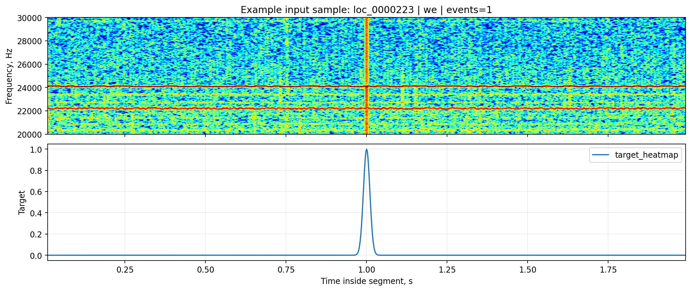

## 3. Формальная постановка

Один обучающий пример:

```text
X in R^(F x T)
```

где:

- `F` - количество частотных bins в полосе `20-30 kHz`;
- `T` - количество временных bins в 2-секундном сегменте;
- `X[f, t]` - значение спектрограммы в dB.

Множество событий внутри сегмента:

```text
E = {tau_1, tau_2, ..., tau_K}
```

где `tau_k` - время события в секундах относительно начала сегмента.

Модель:

```text
f_theta(X) = y_hat
```

где:

```text
y_hat in [0, 1]^T
```

`y_hat[t]` - предсказанная интенсивность/уверенность события в моменте `t`.

## 4. Целевая heatmap

Для обучения события превращаются в гладкую временную heatmap. Вместо того чтобы требовать от модели попасть в один точный bin, вокруг каждого размеченного времени строится узкий гауссов пик:

```text
h_k(t_i) = exp(-((t_i - tau_k)^2) / (2 sigma^2))
```

Если событий несколько, итоговая цель берется как максимум по всем событиям:

```text
y(t_i) = max_k h_k(t_i)
```

Если событий нет:

```text
y(t_i) = 0 для всех i
```

Такой таргет удобен по двум причинам:

- модель получает гладкий обучающий сигнал около события;
- небольшое смещение на несколько миллисекунд штрафуется мягче, чем полное несовпадение.

Иллюстрация:

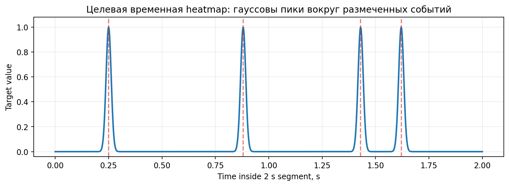

## 5. Предобработка входа

Перед подачей в модель спектрограмма нормализуется по самому сегменту:

```text
X_norm = (X - mean(X)) / (std(X) + eps)
```

где `eps = 1e-6`.

Это важно: абсолютный уровень сигнала может плавать от файла к файлу и от канала к каналу. Нормализация заставляет модель больше смотреть на форму частотно-временного рисунка, а не только на общий уровень мощности.

Базовая подготовка одного сегмента:

1. Прочитать `.bin` файл.
2. Извлечь канал `ns` или `we`.
3. Вырезать 2-секундный временной сегмент.
4. Построить STFT.
5. Перевести мощность в dB.
6. Оставить нужную частотную полосу.
7. Интерпретировать результат как изображение `F x T`.
8. Нормализовать `spec_db`.
9. Передать в CNN.

## 6. Архитектура модели

Текущая модель реализована в:

```text
methods/2d_cnn_localization/train_sferics_localization_2d.py
```

Класс:

```text
SfericsLocalizationCNN
```

Общая схема:

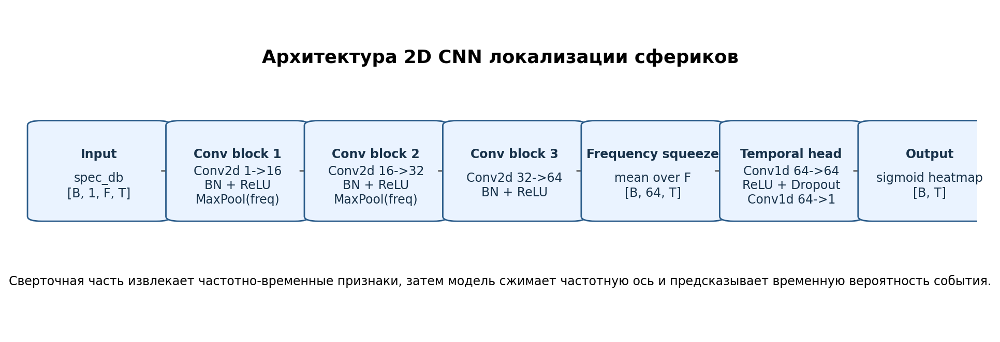

### 6.1. Вход

PyTorch input shape:

```text
[B, 1, F, T]
```

где:

- `B` - batch size;
- `1` - один канал изображения, потому что один пример содержит одну спектрограмму;
- `F` - частотная ось;
- `T` - временная ось.

Важно: физические каналы `ns` и `we` не являются двумя каналами одного tensor. Они обрабатываются как отдельные примеры.

### 6.2. Сверточная часть

Первый блок:

```text
Conv2d(1, 16, kernel_size=3, padding=1)
BatchNorm2d(16)
ReLU()
MaxPool2d(kernel_size=(2, 1))
```

Второй блок:

```text
Conv2d(16, 32, kernel_size=3, padding=1)
BatchNorm2d(32)
ReLU()
MaxPool2d(kernel_size=(2, 1))
```

Третий блок:

```text
Conv2d(32, 64, kernel_size=3, padding=1)
BatchNorm2d(64)
ReLU()
```

Смысл:

- `Conv2d` ищет локальные паттерны на спектрограмме;
- `BatchNorm2d` стабилизирует обучение;
- `ReLU` добавляет нелинейность;
- `MaxPool2d(kernel_size=(2, 1))` уменьшает только частотную ось, но не сжимает время.

Время специально не pooling-ится, потому что задача - сохранить точную локализацию события во времени.

### 6.3. Сжатие частотной оси

После 2D-сверток получается tensor:

```text
H in R^(B x 64 x F' x T)
```

Дальше модель усредняет признаки по частоте:

```text
Z[b, c, t] = (1 / F') * sum_f H[b, c, f, t]
```

Результат:

```text
Z in R^(B x 64 x T)
```

То есть модель сначала извлекает частотно-временные признаки, а затем превращает их в последовательность признаков по времени.

### 6.4. Временная голова

Временная часть:

```text
Conv1d(64, 64, kernel_size=5, padding=2)
ReLU()
Dropout(0.15)
Conv1d(64, 1, kernel_size=1)
Sigmoid()
```

Она работает уже только вдоль времени.

Финальный `sigmoid` ограничивает выход:

```text
0 <= y_hat[t] <= 1
```

Это удобно для интерпретации как heatmap события.

## 7. Обучение модели

Обучались только проверенные человеком строки:

```text
label_source in {manual_verified, manual_corrected}
quality_flag = clean
split in {train, val, test}
```

Текущее состояние обучающего набора:

- `560` проверенных сегментов;
- `415` train;
- `70` val;
- `75` test;
- `280` сегментов `ns`;
- `280` сегментов `we`.

### 7.1. Loss function

Основной loss:

```text
MSE(y_hat, y) = (1 / T) * sum_i (y_hat_i - y_i)^2
```

где:

- `y_hat_i` - предсказание модели;
- `y_i` - целевая heatmap.

Также считается:

```text
MAE(y_hat, y) = (1 / T) * sum_i |y_hat_i - y_i|
```

MAE не используется как основной loss, но удобен для контроля качества.

### 7.2. Оптимизатор

Используется:

```text
AdamW
learning_rate = 1e-3
weight_decay = 1e-4
```

`AdamW` хорошо подходит для небольших CNN и дает более стабильную регуляризацию весов, чем обычный `Adam` с L2.

### 7.3. Выбор лучшей модели

Во время обучения сохраняется состояние с минимальным `val_loss`:

```text
best_state = argmin_epoch val_loss(epoch)
```

Именно оно затем записывается в:

```text
methods/2d_cnn_localization/models/sferics_localization_2d.pt
```

Кривые обучения текущего запуска:

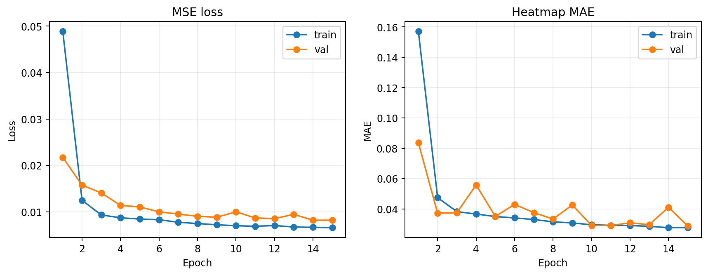

## 8. Как heatmap превращается во времена событий

После инференса модель возвращает временной ряд:

```text
y_hat[0], y_hat[1], ..., y_hat[T-1]
```

Но пользователю нужны события:

```text
[0.124, 0.428, 0.966, ...] seconds
```

Для этого применяется peak picking.

### 8.1. Условие локального максимума

Bin `i` считается кандидатом, если:

```text
y_hat[i] >= y_hat[i - 1]
y_hat[i] >  y_hat[i + 1]
y_hat[i] >= peak_threshold
```

`peak_threshold` - это не параметр обучения. Это порог постобработки, который говорит:

```text
брать только пики heatmap выше этого уровня
```

Например:

```text
peak_threshold = 0.35
```

значит, что пик ниже `0.35` не будет превращен в событие.

### 8.2. Минимальная дистанция между пиками

Чтобы несколько близких максимумов не превратились в несколько событий, используется:

```text
min_peak_distance = 0.03 s
```

Алгоритм:

1. Найти все локальные максимумы выше threshold.
2. Отсортировать их по высоте heatmap.
3. Идти от самых сильных к слабым.
4. Добавлять пик, только если он не ближе `min_peak_distance` к уже выбранным.

Формально, новый peak `p` принимается, если:

```text
forall q in selected: |time(p) - time(q)| >= min_peak_distance
```

### 8.3. Роль `peak_threshold`

`peak_threshold` влияет только на перевод heatmap в список событий. Он не участвует в backpropagation и не меняет веса модели.

Если уменьшить threshold:

- recall обычно растет;
- false positives обычно растут;
- модель начинает брать более слабые пики.

Если увеличить threshold:

- precision обычно растет;
- false positives уменьшаются;
- часть слабых настоящих событий может быть потеряна.

Поэтому threshold надо подбирать по validation/test или по отдельной ручной верификации.

## 9. Метрики качества

Есть два уровня оценки:

1. Heatmap-level.
2. Event-level.

### 9.1. Heatmap-level

`heatmap_mse`:

```text
heatmap_mse = (1 / T) * sum_i (y_hat_i - y_i)^2
```

Показывает среднеквадратичную ошибку между всей предсказанной и целевой heatmap.

`heatmap_mae`:

```text
heatmap_mae = (1 / T) * sum_i |y_hat_i - y_i|
```

Показывает среднюю абсолютную ошибку.

Эти метрики хороши для обучения, но не всегда полностью совпадают с практическим качеством детекции. Например, heatmap может быть чуть ниже по амплитуде, но пики все равно стоят в правильных местах.

### 9.2. Event-level

Для event-level метрик сначала берутся peaks из предсказанной heatmap. Затем они сопоставляются с ручной разметкой.

Используется допуск:

```text
match_tolerance = 0.04 s
```

Предсказание считается true positive, если оно попало в ручное событие ближе чем на `40 ms`.

Обозначения:

- `TP` - найденное настоящее событие;
- `FP` - лишнее предсказанное событие;
- `FN` - пропущенное ручное событие.

Precision:

```text
precision = TP / (TP + FP)
```

Recall:

```text
recall = TP / (TP + FN)
```

F1:

```text
F1 = 2 * precision * recall / (precision + recall)
```

Event count MAE:

```text
event_count_mae = mean(|predicted_event_count - event_count|)
```

## 10. Текущее качество на val/test

Параметры постобработки текущего отчета:

```text
peak_threshold = 0.35
min_peak_distance = 0.03 s
match_tolerance = 0.04 s
```

Validation:

- `heatmap_mse = 0.008199`;
- `heatmap_mae = 0.041086`;
- `event_precision = 0.840`;
- `event_recall = 0.896`;
- `event_f1 = 0.867`;
- `event_count_mae = 0.843`.

Test:

- `heatmap_mse = 0.009894`;
- `heatmap_mae = 0.048916`;
- `event_precision = 0.689`;
- `event_recall = 0.898`;
- `event_f1 = 0.779`;
- `event_count_mae = 1.640`.

Графики:

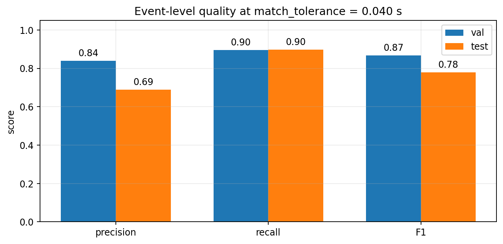

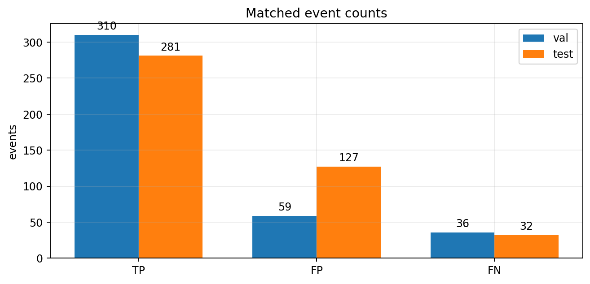

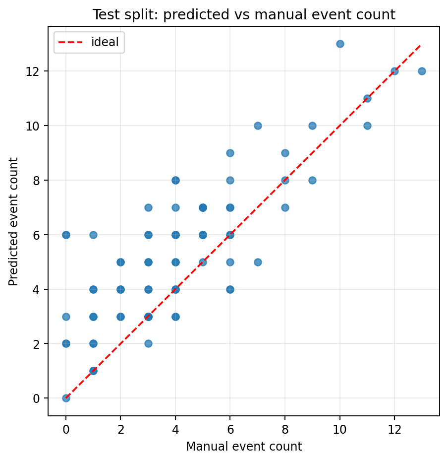

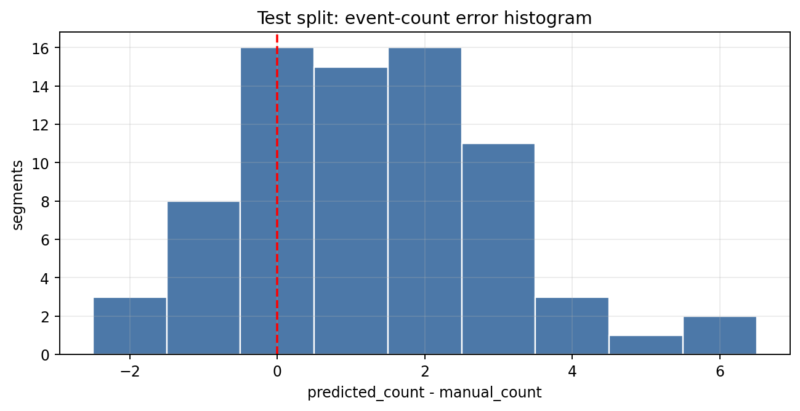

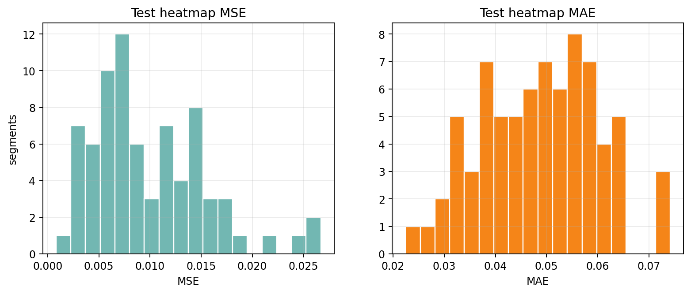

Интерпретация:

- recall высокий: модель видит большую часть ручных событий;
- precision на test ниже, чем на val: модель склонна добавлять лишние пики;
- главный следующий рычаг качества - подбор `peak_threshold` и `min_peak_distance`, а уже потом усложнение архитектуры.

## 11. Применение к сырым файлам

Скрипт инференса:

```text
methods/2d_cnn_localization/run_sferics_localization_2d.py
```

Пример команды:

```bash
python3 methods/2d_cnn_localization/run_sferics_localization_2d.py \
  /home/s_grudinin/code/university/vlf_analyzing/new_test_raw_data \
  --channel both \
  --segment-duration 2 \
  --freq-min 20000 \
  --freq-max 30000 \
  --peak-threshold 0.35 \
  --save-plots \
  --plot-top 6
```

Скрипт делает:

1. Находит `Broadband_Data_*.bin`.
2. Читает каждый файл.
3. Извлекает `ns` и/или `we`.
4. Режет запись на сегменты.
5. Строит спектрограмму для каждого сегмента.
6. Нормализует `spec_db`.
7. Загружает модель `sferics_localization_2d.pt`.
8. Получает predicted heatmap.
9. Превращает heatmap в события через peak picking.
10. Сохраняет CSV/JSON.
11. При необходимости сохраняет PNG со спектрограммой и heatmap.

Основные выходы:

```text
methods/2d_cnn_localization/reports/raw_inference/sferics_localization_2d_raw_predictions.csv
methods/2d_cnn_localization/reports/raw_inference/sferics_localization_2d_raw_summary.json
```

Пример summary по сырому инференсу:

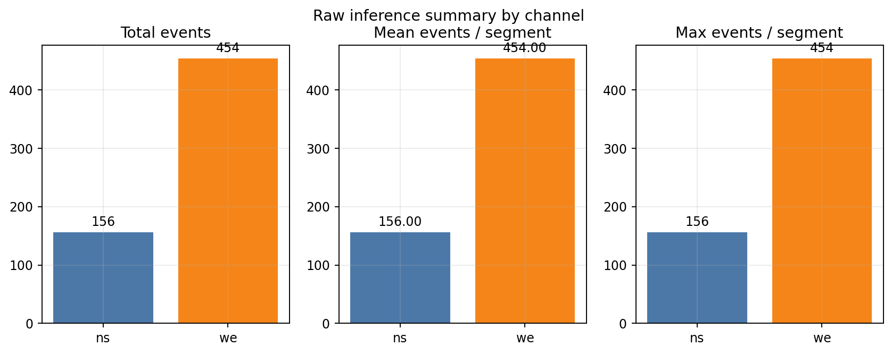

Важно: статистика raw inference без ручной проверки - это не финальная точность. Это только автоматический прогноз модели.

## 12. Интерактивная верификация модели

Для проверки модели на новых сырых данных используется human-in-the-loop скрипт:

```text
methods/2d_cnn_localization/verify_sferics_localization_2d_interactive.py
```

Команда:

```bash
python3 methods/2d_cnn_localization/verify_sferics_localization_2d_interactive.py \
  /home/s_grudinin/code/university/vlf_analyzing/new_test_raw_data \
  --channel both
```

Смысл workflow:

1. Модель предсказывает события.
2. Пользователь видит спектрограмму и predicted heatmap.
3. Если модель права, пример сохраняется как `model_verified`.
4. Если модель ошиблась, пользователь кликами исправляет времена событий, пример сохраняется как `manual_corrected`.
5. После проверки можно построить метрики уже по фактической ручной верификации.

Сводка строится командой:

```bash
python3 methods/2d_cnn_localization/summarize_sferics_localization_verification.py \
  --save-plots
```

Выходы:

```text
methods/2d_cnn_localization/reports/raw_verification/sferics_localization_2d_raw_verification.csv
methods/2d_cnn_localization/reports/raw_verification/sferics_localization_2d_verification_summary.json
methods/2d_cnn_localization/reports/raw_verification/sferics_localization_2d_verification_segment_metrics.csv
methods/2d_cnn_localization/reports/raw_verification/plots/
```

Текущая интерактивная проверка:

- `540` проверенных сегментов;
- `487` сегментов приняты как `model_verified`;
- `53` сегмента исправлены вручную;
- `event_precision = 0.959`;
- `event_recall = 1.000`;
- `event_f1 = 0.979`;
- `event_count_mae = 0.098`.

Графики верификации:

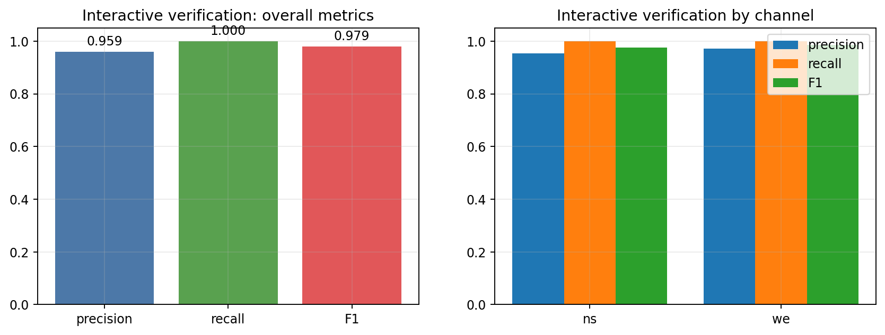

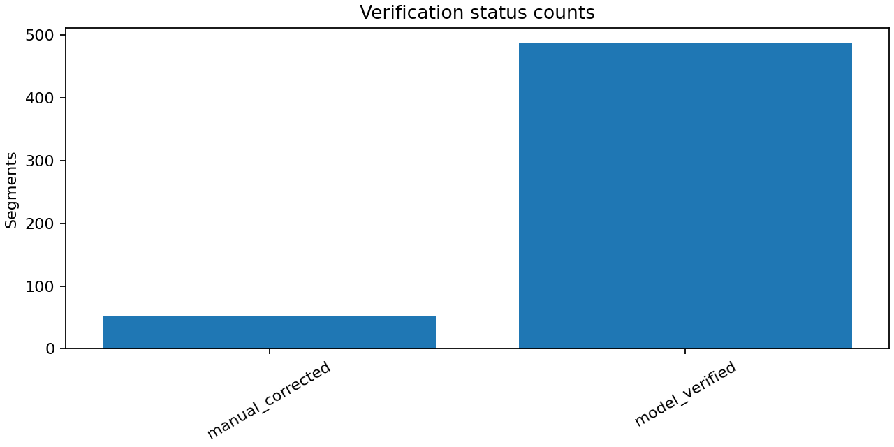

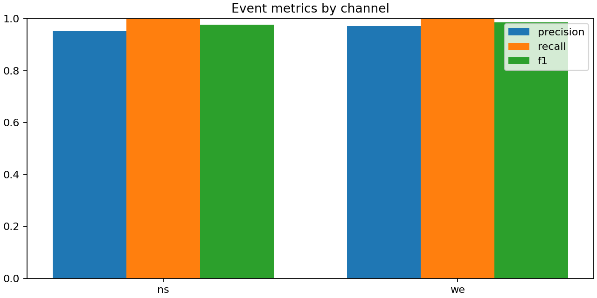

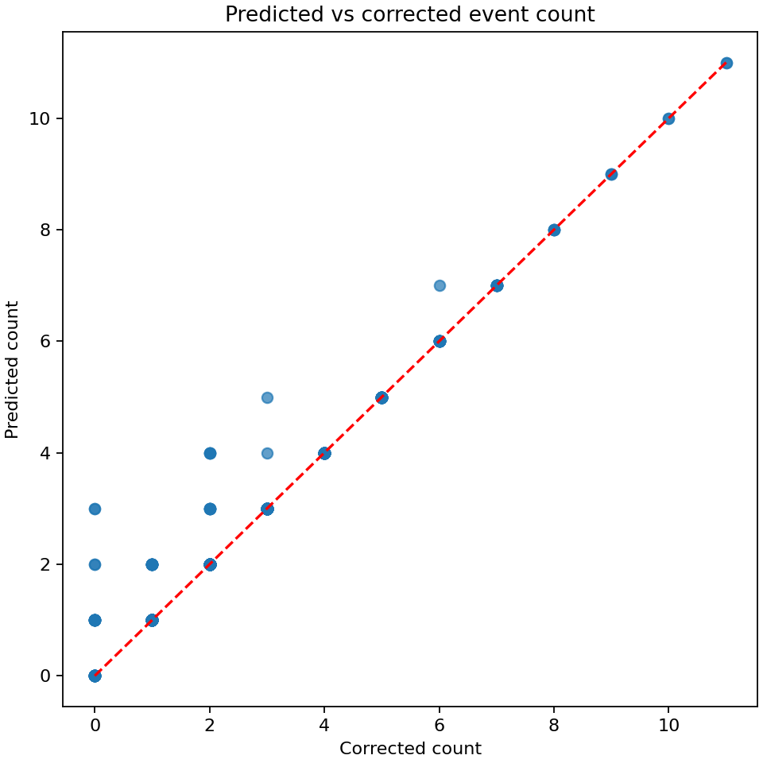

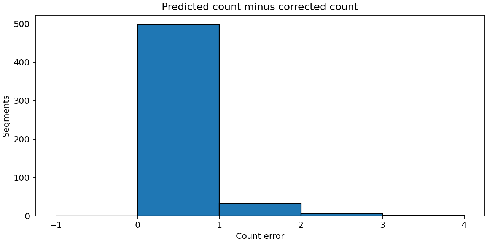

## 13. Почему результаты val/test и raw verification отличаются

На test split качество было:

```text
precision ~= 0.689
recall    ~= 0.898
F1        ~= 0.779
```

На ручной raw verification:

```text
precision ~= 0.959
recall    ~= 1.000
F1        ~= 0.979
```

Это не противоречие. Возможные причины:

- test split содержит более сложные/плотные сегменты;
- ручная raw verification могла быть сделана на другом распределении сегментов;
- параметры инференса могли отличаться, например `peak_threshold`;
- в test CSV метрики считаются против уже существующих labels, а raw verification проверяется человеком в отдельном workflow;
- часть "лишних" предсказаний на старой разметке могла оказаться реальными событиями при более внимательном просмотре.

Поэтому финальную оценку надо делать на отдельном, заранее выбранном наборе сырых файлов, который не участвовал в подготовке train/val/test.

## 14. Практическая интерпретация predicted heatmap

Нижний график в PNG инференса - это predicted heatmap. Его удобно читать так:

- высокий узкий пик - модель видит событие;
- широкий холм - модель неуверенно видит область активности;
- шумные мелкие пики - возможные слабые события или false positives;
- `peak_threshold` задает горизонтальную линию, выше которой пики превращаются в события.

Модель не "знает" заранее число событий. Число получается после peak picking:

```text
predicted_event_count = number_of_selected_peaks(y_hat)
```

Поэтому две части метода разделены:

```text
CNN: спектрограмма -> heatmap
post-processing: heatmap -> список времен
```

## 15. Ограничения текущей версии

Текущая версия - рабочий baseline, но не финальная промышленная модель.

Ограничения:

- обучающих данных пока мало: `560` reviewed examples;
- `test precision` ниже `val precision`, значит есть риск false positives;
- каналы `ns` и `we` учатся одной моделью, но распределения у них разные;
- модель обучена на фиксированной постановке сегмента и частотной полосы;
- threshold подбирается вручную, а не оптимизируется автоматически;
- архитектура пока простая и не использует skip connections, attention или multi-scale признаки;
- модель локализует время события, но не классифицирует тип события.

## 16. Что улучшать дальше

Наиболее полезные следующие шаги:

1. Подобрать `peak_threshold` по validation/test и по raw verification.
2. Сделать threshold sweep и выбрать максимум `event_f1`.
3. Собрать отдельный blind verification dataset из новых raw-файлов.
4. Увеличить ручную разметку, особенно сложных случаев:
   - dense segments;
   - пустые сегменты с помехами;
   - слабые события;
   - участки с регулярными артефактами.
5. Сравнить CNN с пороговым детектором на одном и том же verification set.
6. Проверить отдельные thresholds для `ns` и `we`.
7. Попробовать более устойчивую архитектуру:
   - residual CNN;
   - U-Net-подобную временную голову;
   - multi-scale temporal convolutions;
   - отдельную count-head для оценки числа событий.

## 17. Краткая формула всего метода

Вся логика в компактном виде:

```text
X = spectrogram(raw_segment)
X_norm = (X - mean(X)) / (std(X) + eps)
y_hat = CNN_theta(X_norm)
P = local_maxima(y_hat, threshold=peak_threshold)
events = non_max_suppression(P, min_distance=min_peak_distance)
```

Обучение:

```text
theta* = argmin_theta mean(MSE(CNN_theta(X), target_heatmap))
```

Оценка:

```text
TP/FP/FN = match(predicted_events, manual_events, tolerance=0.04 s)
precision = TP / (TP + FP)
recall = TP / (TP + FN)
F1 = 2PR / (P + R)
```

## 18. Где лежат связанные артефакты

Модель:

```text
methods/2d_cnn_localization/models/sferics_localization_2d.pt
```

Метрики обучения:

```text
methods/2d_cnn_localization/reports/sferics_localization_2d_metrics.json
```

Предсказания val/test:

```text
methods/2d_cnn_localization/reports/sferics_localization_2d_val_predictions.csv
methods/2d_cnn_localization/reports/sferics_localization_2d_test_predictions.csv
```

Raw inference:

```text
methods/2d_cnn_localization/reports/raw_inference/
```

Raw verification:

```text
methods/2d_cnn_localization/reports/raw_verification/
```

Картинки для этого документа:

```text
docs/assets/2d_cnn_detection/
```
