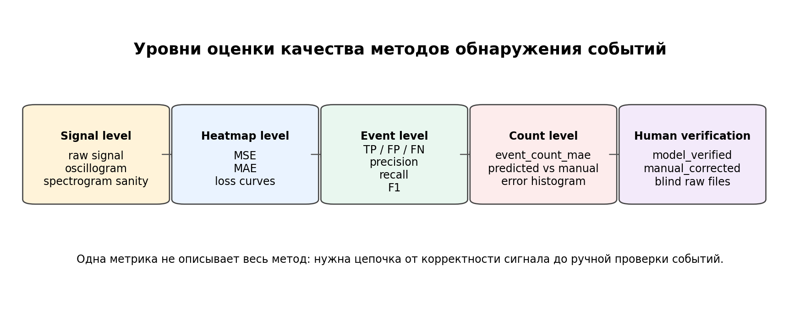
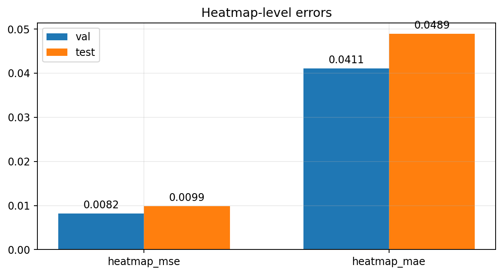
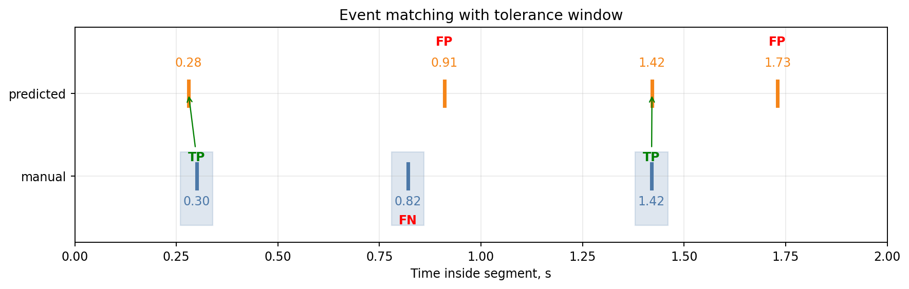
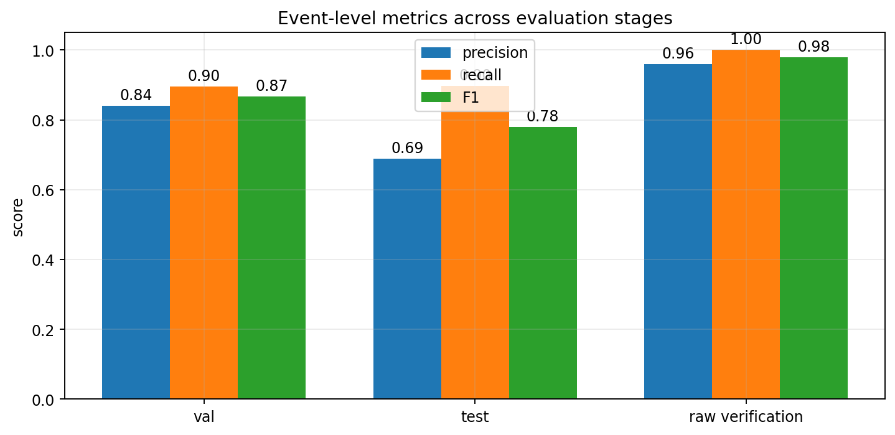
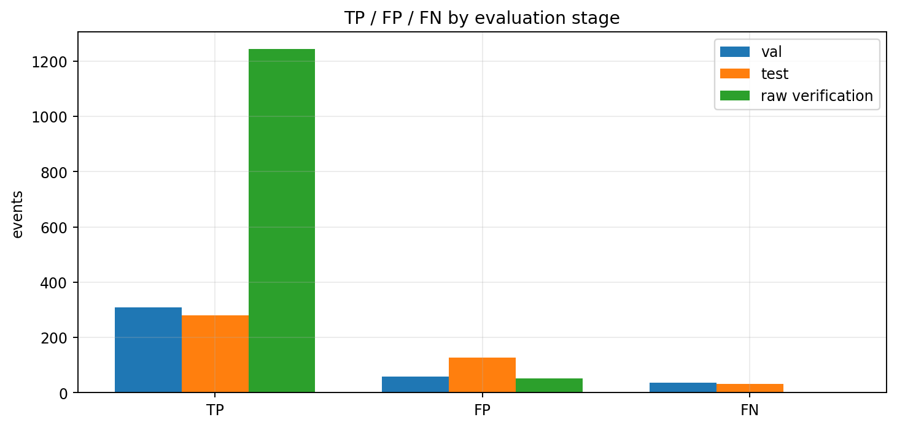
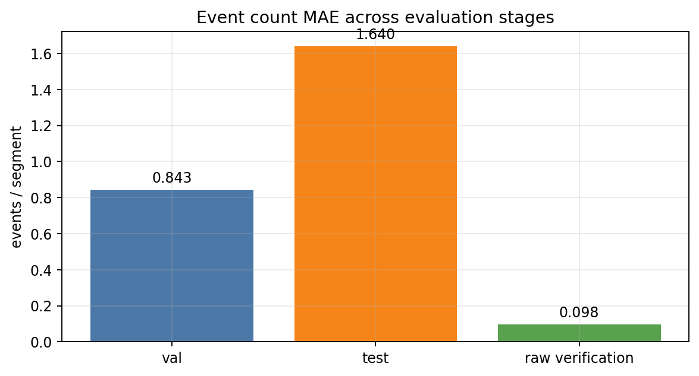
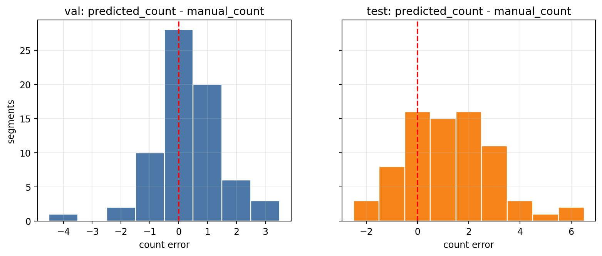
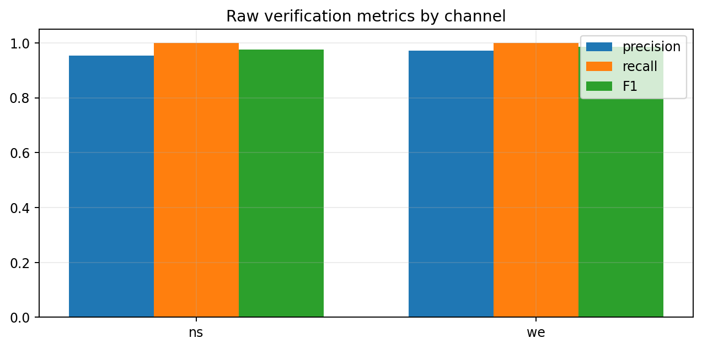
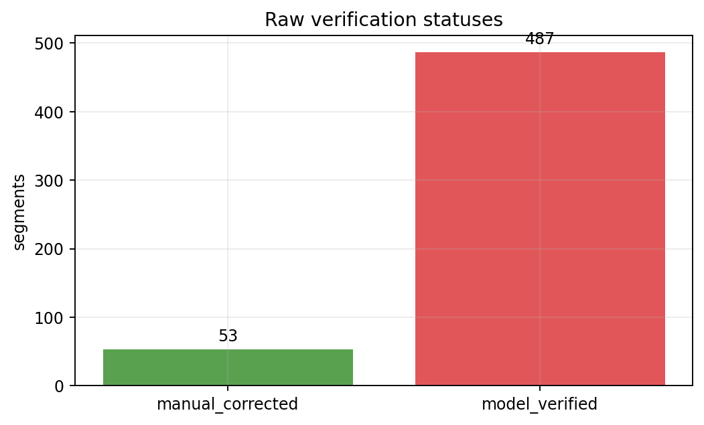

# Метрики и оценка качества работы методов

## 1. Назначение главы

Эта глава описывает, как оценивать качество методов обнаружения сфериков в текущем проекте.

В проекте есть несколько уровней методов:

- базовая обработка сигнала и построение спектрограмм;
- пороговый детектор по огибающей мощности;
- модель `2D CNN -> temporal heatmap`;
- интерактивная ручная верификация результатов модели.

Для такой цепочки недостаточно одной метрики. Например, низкий `heatmap_mse` не гарантирует, что каждое событие найдено как отдельный пик, а высокая полнота `recall` может сопровождаться большим числом ложных срабатываний.

Поэтому качество оценивается на нескольких уровнях:



## 2. Обозначения

Рассмотрим один 2-секундный сегмент.

Ручная разметка событий:

```text
E = {tau_1, tau_2, ..., tau_K}
```

где:

- `K` - реальное число событий в сегменте;
- `tau_k` - время события внутри сегмента в секундах.

Предсказание метода после постобработки:

```text
P = {p_1, p_2, ..., p_M}
```

где:

- `M` - предсказанное число событий;
- `p_j` - предсказанное время события.

Для CNN также есть непрерывное по временным bins предсказание:

```text
y_hat in [0, 1]^T
```

и целевая heatmap:

```text
y in [0, 1]^T
```

где `T` - число временных bins.

## 3. Уровни оценки

### 3.1. Signal-level sanity check

Это не формальная ML-метрика, но обязательный контроль перед сравнением методов.

Проверяется:

- корректно ли прочитан `.bin` файл;
- нет ли явного перепутывания каналов `ns` и `we`;
- адекватны ли осциллограмма и спектрограмма;
- видна ли ожидаемая частотная полоса;
- не является ли файл технически поврежденным;
- нет ли слишком сильных артефактов, делающих сегмент непригодным.

Этот уровень важен, потому что плохой входной сигнал может испортить любую downstream-метрику.

### 3.2. Heatmap-level оценка

Используется для CNN-модели.

Она отвечает на вопрос:

```text
насколько форма предсказанной heatmap похожа на целевую heatmap?
```

### 3.3. Event-level оценка

Используется для порогового детектора, CNN после peak picking и ручной верификации.

Она отвечает на вопрос:

```text
сколько реальных событий найдено, сколько добавлено лишних и сколько пропущено?
```

### 3.4. Count-level оценка

Отдельно оценивается число событий в сегменте:

```text
event_count
```

Это полезно, потому что иногда метод может найти события примерно в правильной области, но неверно разделить близкие события или добавить лишние пики.

### 3.5. Human verification

Финальный уровень - интерактивная проверка на новых сырых файлах.

Здесь модель сначала делает прогноз, затем человек подтверждает или исправляет его. Это самый ценный тип оценки, потому что он ближе всего к реальному использованию метода.

## 4. Heatmap-level метрики

Для CNN модель предсказывает временную heatmap:

```text
y_hat = f_theta(X)
```

Целевая heatmap:

```text
y
```

где `X` - спектрограмма сегмента.

### 4.1. Mean Squared Error

```text
MSE(y_hat, y) = (1 / T) * sum_{i=1}^{T} (y_hat_i - y_i)^2
```

В отчётах эта метрика называется:

```text
heatmap_mse
```

Интерпретация:

- сильно штрафует большие ошибки;
- чувствительна к высоким ложным пикам;
- используется как основной `loss` при обучении CNN.

### 4.2. Mean Absolute Error

```text
MAE(y_hat, y) = (1 / T) * sum_{i=1}^{T} |y_hat_i - y_i|
```

В отчётах:

```text
heatmap_mae
```

Интерпретация:

- проще читается как средняя абсолютная ошибка heatmap;
- менее чувствительна к отдельным большим ошибкам, чем MSE;
- хорошо показывает общий уровень расхождения между кривыми.

### 4.3. Текущие heatmap-результаты

Для обученной 2D CNN:

```text
val:
  heatmap_mse = 0.008199
  heatmap_mae = 0.041086

test:
  heatmap_mse = 0.009894
  heatmap_mae = 0.048916
```

График:



Важно: heatmap-метрики оценивают форму кривой, а не финальный список событий. Поэтому они должны рассматриваться вместе с event-level метриками.

## 5. Преобразование heatmap в события

Для CNN список событий получается не напрямую, а через post-processing:

```text
predicted heatmap -> local maxima -> threshold -> min distance -> event times
```

Кандидат `i` считается пиком, если:

```text
y_hat_i >= y_hat_{i-1}
y_hat_i >  y_hat_{i+1}
y_hat_i >= peak_threshold
```

После этого близкие пики подавляются по правилу:

```text
|p_i - p_j| >= min_peak_distance
```

В текущем отчёте использовались:

```text
peak_threshold = 0.35
min_peak_distance = 0.03 s
```

Важно:

```text
peak_threshold не обучает модель
```

Это параметр постобработки, влияющий на баланс между ложными срабатываниями и пропусками.

## 6. Event matching

Чтобы сравнить предсказанные события с ручными, используется временной допуск:

```text
match_tolerance = 0.04 s
```

Предсказание `p_j` считается совпавшим с ручным событием `tau_k`, если:

```text
|p_j - tau_k| <= match_tolerance
```

Одно ручное событие может быть сопоставлено максимум с одним предсказанием.

Иллюстрация:



## 7. TP, FP, FN

После matching считаются:

```text
TP = true positives
FP = false positives
FN = false negatives
```

### 7.1. True Positive

`TP` - предсказанное событие, для которого нашлось ручное событие в пределах `match_tolerance`.

```text
exists tau_k: |p_j - tau_k| <= delta
```

где:

```text
delta = match_tolerance
```

### 7.2. False Positive

`FP` - предсказанное событие, которому не соответствует ни одно ручное событие.

Пример:

```text
модель увидела пик, но человек не считает его сфериком
```

### 7.3. False Negative

`FN` - ручное событие, для которого метод не дал предсказания в пределах допуска.

Пример:

```text
на спектрограмме есть сферик, но метод его пропустил
```

## 8. Precision, Recall, F1

### 8.1. Precision

```text
precision = TP / (TP + FP)
```

Смысл:

```text
какая доля предсказанных событий действительно является событиями?
```

Высокий precision означает мало ложных срабатываний.

### 8.2. Recall

```text
recall = TP / (TP + FN)
```

Смысл:

```text
какая доля реальных событий найдена методом?
```

Высокий recall означает мало пропусков.

### 8.3. F1-score

```text
F1 = 2 * precision * recall / (precision + recall)
```

Смысл:

```text
сбалансированная метрика между precision и recall
```

F1 особенно полезен при подборе `peak_threshold`: если threshold слишком низкий, растут `FP`; если слишком высокий, растут `FN`.

## 9. Event count MAE

Для каждого сегмента:

```text
count_error = predicted_event_count - manual_event_count
```

Абсолютная ошибка:

```text
abs_count_error = |predicted_event_count - manual_event_count|
```

Средняя ошибка:

```text
event_count_mae = (1 / N) * sum_{n=1}^{N} |M_n - K_n|
```

где:

- `N` - число сегментов;
- `M_n` - предсказанное число событий;
- `K_n` - ручное число событий.

Метрика отвечает на простой вопрос:

```text
в среднем на сколько событий ошибается метод в одном сегменте?
```

## 10. Текущие результаты CNN на val/test

Параметры оценки:

```text
peak_threshold = 0.35
min_peak_distance = 0.03 s
match_tolerance = 0.04 s
```

Validation:

```text
TP = 310
FP = 59
FN = 36
precision = 0.840
recall = 0.896
F1 = 0.867
event_count_mae = 0.843
```

Test:

```text
TP = 281
FP = 127
FN = 32
precision = 0.689
recall = 0.898
F1 = 0.779
event_count_mae = 1.640
```

Графики:







## 11. Интерпретация val/test результатов

Главное наблюдение:

```text
recall высокий, precision на test заметно ниже
```

Это означает:

- модель обычно видит реальные события;
- но на test split добавляет много лишних событий;
- наиболее вероятная проблема - слишком мягкая постобработка или сложные сегменты в test.

С практической точки зрения это лучше, чем обратная ситуация на раннем этапе: лишние срабатывания проще подавлять threshold/min-distance/post-filtering, а пропущенные слабые события сложнее восстановить.

Гистограммы ошибок по числу событий:



## 12. Результаты интерактивной raw verification

Отдельно была проведена ручная проверка результатов модели на сырых данных.

Сводка:

```text
reviewed_rows = 540
model_verified = 487
manual_corrected = 53
```

Event-level результат:

```text
TP = 1243
FP = 53
FN = 0
precision = 0.959
recall = 1.000
F1 = 0.979
event_count_mae = 0.098
```

По каналам:

```text
ns:
  segments = 270
  precision = 0.953
  recall = 1.000
  F1 = 0.976
  event_count_mae = 0.148

we:
  segments = 270
  precision = 0.971
  recall = 1.000
  F1 = 0.985
  event_count_mae = 0.048
```

Графики:





## 13. Почему test и raw verification могут отличаться

Разница между test split и raw verification не обязательно означает ошибку.

Возможные причины:

- test split мог содержать более сложные сегменты;
- raw verification могла проверяться на другом распределении данных;
- часть старых labels могла быть менее точной, чем новая ручная проверка;
- параметры `peak_threshold` могли отличаться между экспериментами;
- при интерактивной проверке человек мог признать реальные слабые события, которые раньше считались лишними.

Поэтому эти результаты надо трактовать раздельно:

- `val/test` - контроль качества на размеченном датасете;
- `raw verification` - контроль поведения модели в реальном сценарии применения.

## 14. Метрики для порогового детектора

Пороговый детектор также должен оцениваться event-level метриками.

Для него нет `heatmap_mse`, потому что он не предсказывает heatmap. Он сразу дает список событий:

```text
envelope_db -> threshold -> local peaks -> event_times
```

Для сравнения с CNN нужны те же:

```text
TP, FP, FN, precision, recall, F1, event_count_mae
```

Это важно: пороговый детектор и CNN должны сравниваться не по внутренним признакам, а по одному и тому же конечному критерию:

```text
насколько правильно найдены времена событий?
```

## 15. Рекомендуемый протокол сравнения методов

Чтобы сравнение было честным, нужен один и тот же набор ручной проверки.

Рекомендуемый протокол:

1. Выбрать набор новых raw-файлов, которые не участвовали в обучении.
2. Зафиксировать список сегментов и каналов.
3. Запустить пороговый детектор.
4. Запустить CNN.
5. Ручным workflow получить corrected/verified разметку.
6. Посчитать одинаковые event-level метрики для обоих методов.
7. Отдельно сравнить:
   - `precision`;
   - `recall`;
   - `F1`;
   - `event_count_mae`;
   - распределение ошибок счета;
   - ошибки по каналам `ns` и `we`;
   - ошибки на пустых, одиночных, few и dense сегментах.

## 16. Подбор threshold по метрикам

Для CNN `peak_threshold` можно подбирать sweep-ом.

Пусть:

```text
tau in {0.20, 0.25, 0.30, ..., 0.80}
```

Для каждого `tau`:

1. взять predicted heatmap;
2. извлечь peaks с threshold `tau`;
3. сопоставить events с ручной разметкой;
4. посчитать precision/recall/F1;
5. выбрать threshold по максимуму F1 или по нужному рабочему режиму.

Формально:

```text
tau* = argmax_tau F1(tau)
```

Если важнее не пропустить события:

```text
выбирать tau с высоким recall
```

Если важнее минимизировать ложные срабатывания:

```text
выбирать tau с высоким precision
```

## 17. Что считать хорошим результатом

Для текущей задачи можно ориентироваться так:

- `recall >= 0.90` - метод хорошо находит большую часть событий;
- `precision >= 0.90` - мало лишних срабатываний;
- `F1 >= 0.90` - хороший общий баланс;
- `event_count_mae <= 0.2` на сегмент - очень хорошая оценка числа событий;
- `event_count_mae <= 1.0` - приемлемо для раннего baseline, но есть куда улучшать.

Эти границы не являются универсальными. Для научного отчёта важно не только число, но и условия:

- какой набор данных;
- сколько сегментов;
- какие каналы;
- какой threshold;
- был ли dataset независимым от обучения;
- кто и как делал ручную проверку.

## 18. Итоговая таблица текущего состояния

```text
2D CNN на reviewed dataset:
  val:
    precision = 0.840
    recall    = 0.896
    F1        = 0.867
    count MAE = 0.843

  test:
    precision = 0.689
    recall    = 0.898
    F1        = 0.779
    count MAE = 1.640

2D CNN на raw verification:
  reviewed segments = 540
  precision = 0.959
  recall    = 1.000
  F1        = 0.979
  count MAE = 0.098
```

Главный вывод:

```text
CNN уже уверенно находит большую часть событий, но оценку качества надо продолжать на независимых raw-файлах и обязательно фиксировать параметры peak picking.
```

## 19. Какие графики включать в отчёт

Для главы результатов лучше включить:

1. Схему уровней метрик.
2. Иллюстрацию event matching.
3. График precision/recall/F1 для val/test/raw verification.
4. TP/FP/FN bar chart.
5. Event count MAE.
6. Гистограмму ошибок счета.
7. Метрики raw verification по каналам.

Минимальный набор для текста диплома или практического отчёта:

```text
precision / recall / F1 + event_count_mae + описание match_tolerance
```

Без `match_tolerance` event-level метрики неполны, потому что неясно, насколько точно метод обязан попасть во время события.

