# 4.2. Результаты оценки моделей

## 4.2.1. Цель раздела

В данном разделе приведены результаты оценки методов обнаружения сфериков, реализованных в текущей ветке проекта.

Основной количественно оцененный метод:

```text
2D CNN localization model
```

Его задача:

```text
спектрограмма 2-секундного сегмента -> временная heatmap -> времена событий
```

Пороговый детектор в текущей версии проекта используется как:

- первичный auto-labeler при сборе датасета;
- baseline-метод для будущего честного сравнения;
- источник начальной разметки, которая затем проверялась вручную.

Важно: полноценное численное сравнение `threshold detector vs 2D CNN` на одном и том же независимом verification set пока не выполнено. Поэтому в этой главе количественные выводы относятся прежде всего к 2D CNN и её интерактивной проверке на новых сырых данных.

Сводная картина результатов:

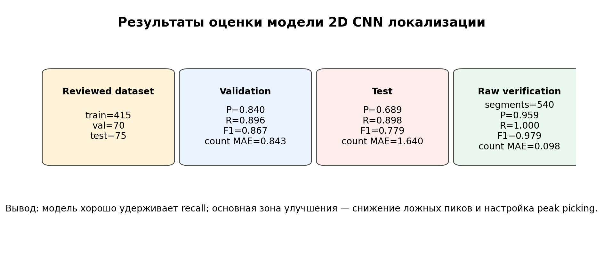

## 4.2.2. Использованные наборы данных

Для оценки использовались три уровня данных.

### Reviewed train/val/test split

После ручной проверки датасета в `dataset_localization/metadata.csv` были выделены проверенные строки:

```text
manual_verified
manual_corrected
```

Текущий reviewed split:

```text
train = 415 сегментов
val   = 70 сегментов
test  = 75 сегментов
```

Этот split использовался для обучения, выбора лучшего состояния модели и оценки на отложенном test subset.

### Validation subset

Validation subset использовался для контроля обучения и выбора лучшей модели:

```text
best model = checkpoint с минимальным val_loss
```

Лучший checkpoint был выбран на `14` эпохе:

```text
best_val_loss = 0.008199
```

### Raw verification set

Отдельно была проведена интерактивная проверка модели на сырых файлах.

Итог:

```text
reviewed_rows = 540
model_verified = 487
manual_corrected = 53
```

Этот набор отражает поведение модели в более практическом сценарии:

```text
модель делает прогноз -> человек подтверждает или исправляет
```

## 4.2.3. Параметры оценки

Для преобразования predicted heatmap в список событий использовались:

```text
peak_threshold = 0.35
min_peak_distance = 0.03 s
```

Для сопоставления предсказанных и ручных событий:

```text
match_tolerance = 0.04 s
```

То есть событие считалось найденным, если предсказанное время отличалось от ручного не более чем на `40 ms`.

Основные метрики:

```text
precision = TP / (TP + FP)
recall    = TP / (TP + FN)
F1        = 2 * precision * recall / (precision + recall)
count MAE = mean(|predicted_event_count - manual_event_count|)
```

Для самой heatmap дополнительно оценивались:

```text
heatmap_mse
heatmap_mae
```

Подробное описание метрик приведено в:

```text
docs/METRICS_AND_QUALITY_EVALUATION_RU.md
```

## 4.2.4. Динамика обучения модели

Модель обучалась `15` эпох. Графики loss показывают быстрое снижение ошибки на первых эпохах и дальнейшую стабилизацию.

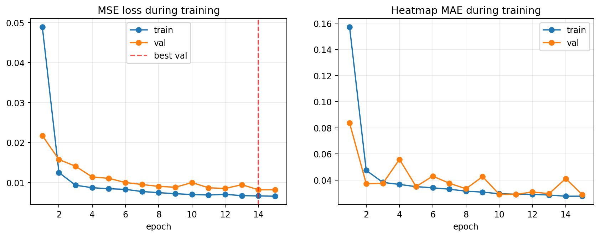

Основные наблюдения:

- `train_loss` стабильно уменьшается;
- `val_loss` также снижается и достигает минимума около `14` эпохи;
- сильного расхождения train/val loss не наблюдается;
- модель не выглядит явно переобученной по loss-кривым;
- колебания `val_mae` показывают, что набор validation небольшой и отдельные сложные сегменты заметно влияют на среднюю ошибку.

Итоговый лучший validation loss:

```text
best_val_loss = 0.008199
```

## 4.2.5. Результаты на validation и test

Общие event-level результаты:

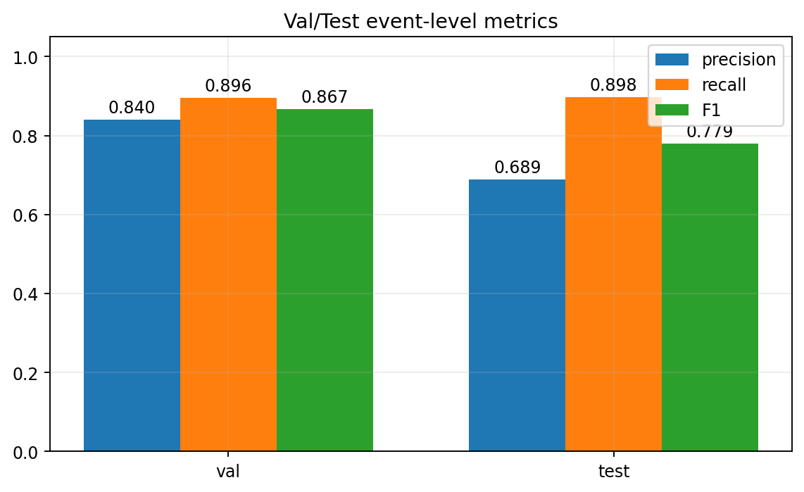

**Таблица 1. Оценка качества работы модели 2D CNN локализации**

| Набор данных | Сегменты | TP | FP | FN | Precision | Recall | F1 | Event count MAE | Heatmap MSE | Heatmap MAE |
|---|---:|---:|---:|---:|---:|---:|---:|---:|---:|---:|
| Validation | 70 | 310 | 59 | 36 | 0.840 | 0.896 | 0.867 | 0.843 | 0.008199 | 0.041086 |
| Test | 75 | 281 | 127 | 32 | 0.689 | 0.898 | 0.779 | 1.640 | 0.009894 | 0.048916 |
| Raw verification | 540 | 1243 | 53 | 0 | 0.959 | 1.000 | 0.979 | 0.098 | - | - |

Для `raw verification` не указаны `heatmap_mse` и `heatmap_mae`, потому что этот этап оценивался через ручную коррекцию событий, а не через заранее сохраненную целевую heatmap для каждого сегмента.

Validation:

```text
TP = 310
FP = 59
FN = 36
precision = 0.840
recall = 0.896
F1 = 0.867
event_count_mae = 0.843
```

Test:

```text
TP = 281
FP = 127
FN = 32
precision = 0.689
recall = 0.898
F1 = 0.779
event_count_mae = 1.640
```

Сравнение TP/FP/FN:

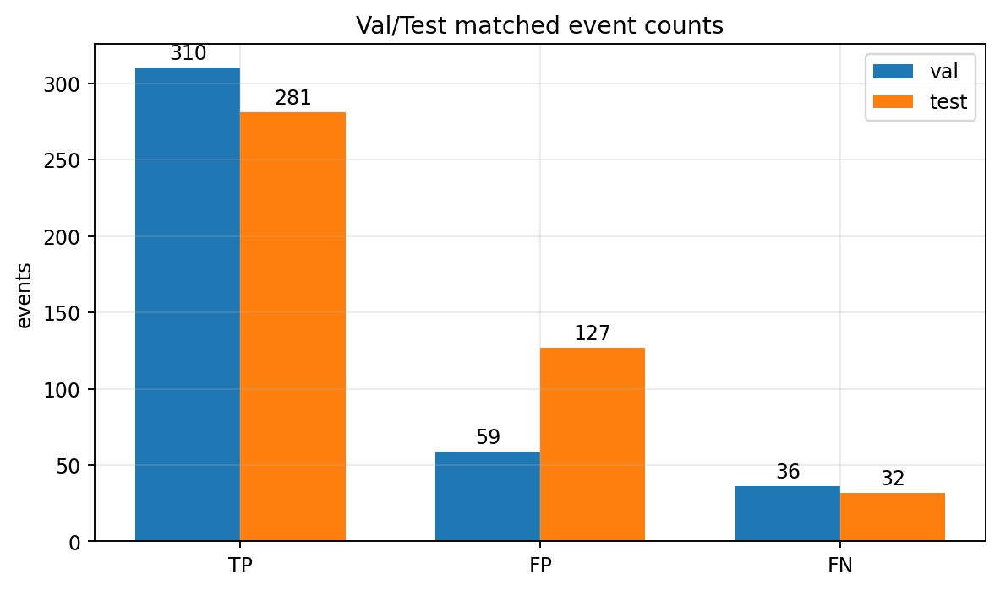

Матрицы ошибок обнаружения событий:

Validation:

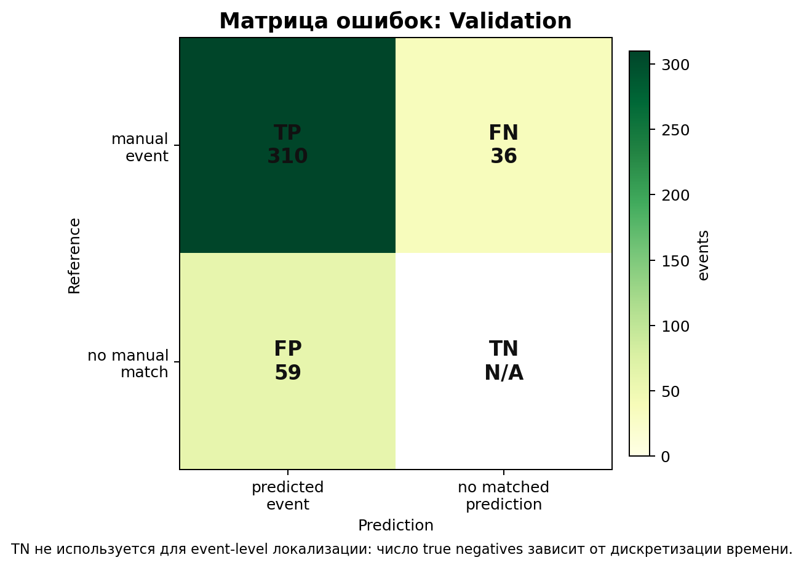

На validation модель показывает сбалансированное качество: `TP = 310`, `FP = 59`, `FN = 36`. Ошибки есть, но число найденных событий существенно выше числа ложных и пропущенных.

Test:

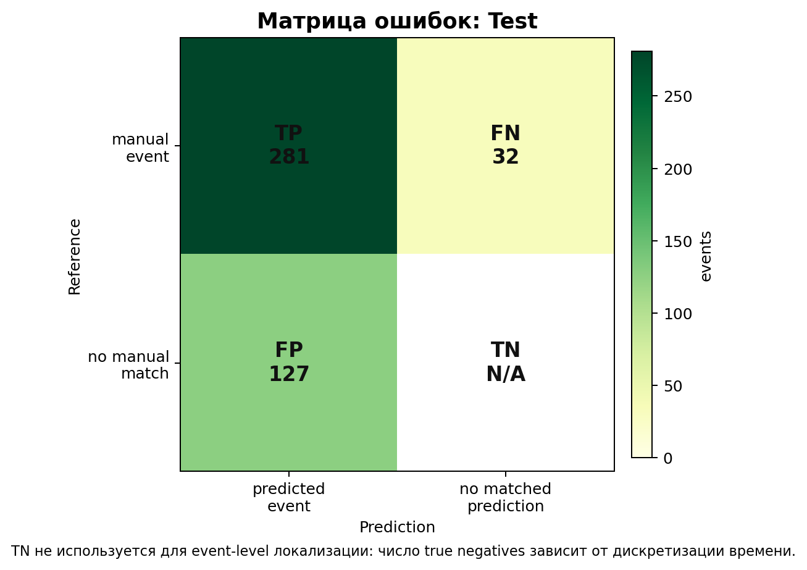

На test сохраняется близкое к validation число пропусков (`FN = 32`), но резко возрастает число ложных событий (`FP = 127`). Это главный источник падения precision.

Raw verification:

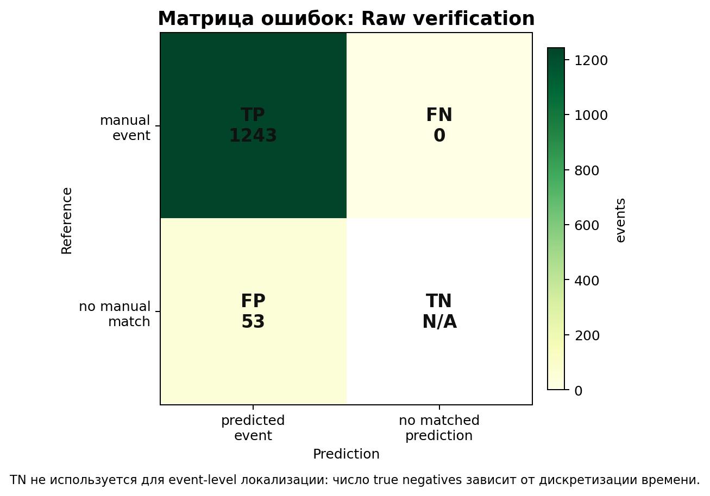

На raw verification после интерактивной проверки не осталось пропущенных событий (`FN = 0`), а число ложных событий составило `FP = 53` при `TP = 1243`. Это объясняет высокий итоговый `F1 = 0.979`.

В этой матрице:

- `TP` - событие найдено в пределах `match_tolerance`;
- `FP` - модель предсказала лишнее событие;
- `FN` - ручное событие пропущено;
- `TN` не используется, потому что в задаче локализации событий нет естественного конечного числа "правильных отсутствий события": оно зависело бы от выбранной дискретизации временной оси.

Главный вывод:

```text
модель сохраняет высокий recall на test, но precision заметно падает из-за роста FP
```

Иными словами, модель чаще добавляет лишние события, чем пропускает настоящие.

## 4.2.6. Результаты по каналам

Разрез по каналам показывает, что качество существенно отличается для `ns` и `we`.

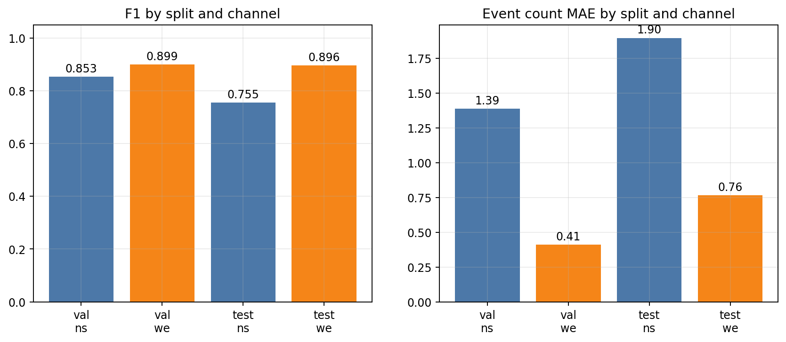

Validation:

```text
ns:
  precision = 0.825
  recall = 0.883
  F1 = 0.853
  count MAE = 1.387

we:
  precision = 0.875
  recall = 0.925
  F1 = 0.899
  count MAE = 0.410
```

Test:

```text
ns:
  precision = 0.658
  recall = 0.886
  F1 = 0.755
  count MAE = 1.897

we:
  precision = 0.848
  recall = 0.949
  F1 = 0.896
  count MAE = 0.765
```

Вывод:

```text
основная деградация test-качества происходит на канале ns
```

На `we` модель работает заметно стабильнее: F1 на test около `0.896`, а ошибка числа событий меньше одного события на сегмент.

На `ns` модель склонна добавлять лишние пики, что видно по низкому precision и высокому `event_count_mae`.

## 4.2.7. Ошибка числа событий

Для практического использования важно не только наличие попаданий, но и точность количества событий в сегменте.

Гистограммы ошибки:

```text
count_error = predicted_event_count - manual_event_count
```

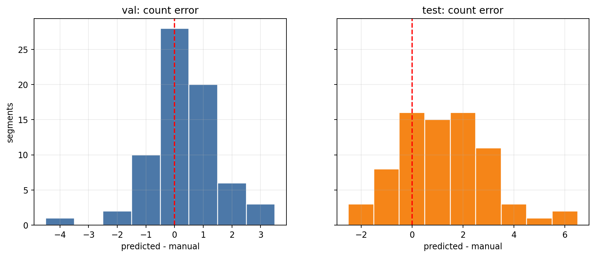

Интерпретация:

- значение `0` означает точное совпадение числа событий;
- положительные значения означают лишние предсказанные события;
- отрицательные значения означают пропущенные события.

На test split распределение сильнее смещено в положительную сторону. Это согласуется с большим числом `FP = 127`.

## 4.2.8. Связь heatmap-ошибки и ошибки счета

На test subset дополнительно была построена зависимость:

```text
heatmap_mse vs count_error
```

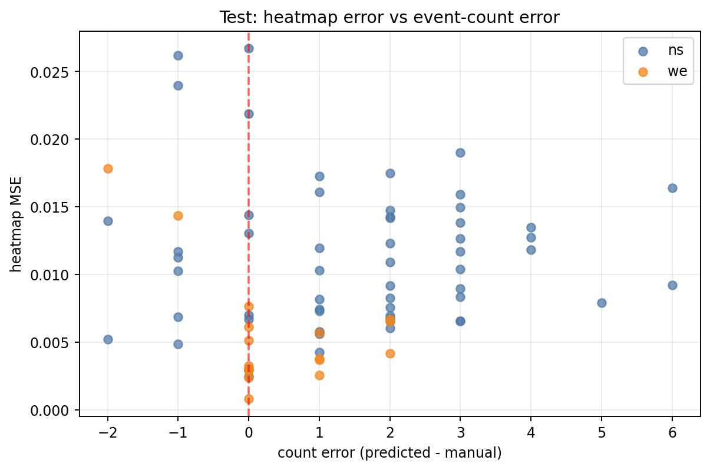

Вывод:

- высокая heatmap-ошибка часто соответствует сложным сегментам;
- однако count error может быть ненулевым даже при умеренной heatmap MSE;
- это подтверждает, что качество финального детектора зависит не только от CNN, но и от peak picking.

То есть метод состоит из двух частей:

```text
CNN качество heatmap + post-processing качество peaks
```

Улучшать надо обе части.

## 4.2.9. Наиболее проблемные test-примеры

В таблице ниже приведены test-примеры с наибольшим числом event-level ошибок.

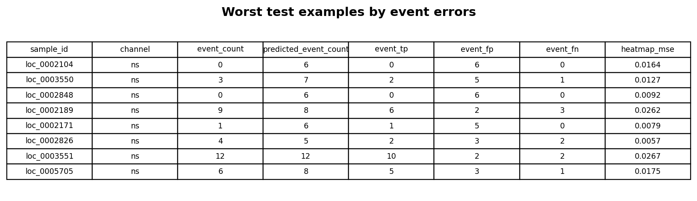

По таким примерам удобно проводить error analysis:

- открыть соответствующую спектрограмму;
- сравнить ручные времена и predicted times;
- понять, ошибка связана с моделью или с threshold/post-processing;
- проверить, нет ли спорной ручной разметки;
- выделить типовые сценарии ошибок.

Предварительно видно, что проблемные случаи часто связаны с:

- плотными группами событий;
- близкими импульсами;
- шумными участками;
- дополнительными слабыми пиками.

## 4.2.10. Результаты интерактивной проверки на сырых данных

Отдельная проверка была проведена на сырых данных в интерактивном режиме.

Сводка:

```text
reviewed segments = 540
model_verified = 487
manual_corrected = 53
```

То есть:

```text
90.2% сегментов были приняты без ручной коррекции
9.8% сегментов потребовали исправления
```

Графики:

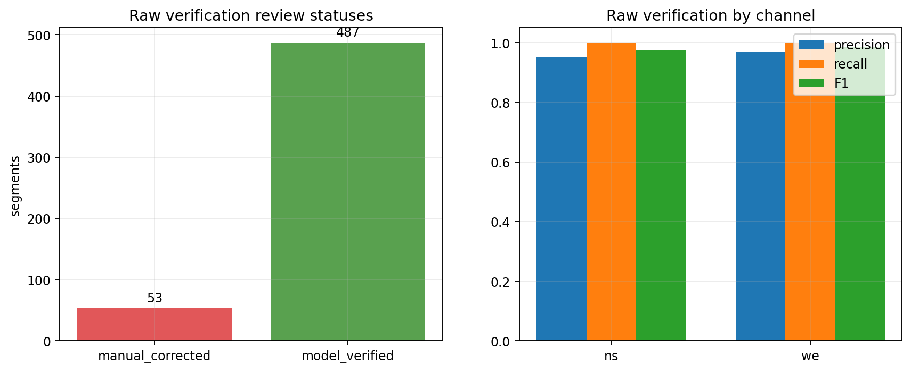

Метрики:

```text
overall:
  TP = 1243
  FP = 53
  FN = 0
  precision = 0.959
  recall = 1.000
  F1 = 0.979
  event_count_mae = 0.098
```

Распределение результатов обнаружения на независимом проверочном наборе:

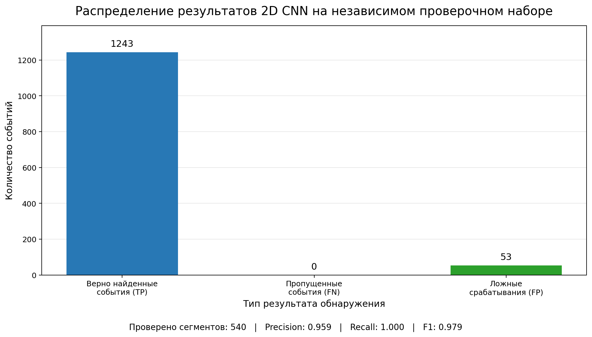

Модель верно локализовала `1243` события, не пропустила размеченных событий и добавила `53` ложных срабатывания. Это соответствует `recall = 1.000` и `precision = 0.959`.

Категория `TN` на график не добавлялась, поскольку в задаче временной локализации нет естественного конечного числа верно отклоненных временных позиций.

По каналам:

```text
ns:
  segments = 270
  precision = 0.953
  recall = 1.000
  F1 = 0.976
  event_count_mae = 0.148

we:
  segments = 270
  precision = 0.971
  recall = 1.000
  F1 = 0.985
  event_count_mae = 0.048
```

Гистограмма ошибки числа событий:

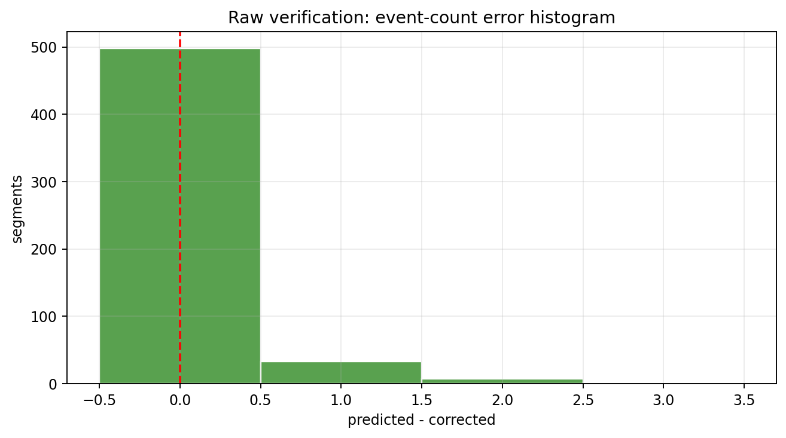

Вывод:

```text
на интерактивно проверенном raw-наборе модель показала очень высокое качество
```

При этом важно не смешивать этот результат с test split: это другой набор и другой сценарий проверки.

## 4.2.11. Почему raw verification лучше test split

На первый взгляд результаты отличаются сильно:

```text
test F1 = 0.779
raw verification F1 = 0.979
```

Это не обязательно противоречие.

Возможные причины:

1. Test subset мог содержать более сложные сегменты.
2. В test больше проблемных `ns` примеров.
3. Raw verification могла проводиться на другом распределении файлов.
4. Часть старой разметки могла быть менее точной.
5. При интерактивной проверке человек мог подтвердить слабые события, которые в старом test считались бы ложными.
6. Параметры или сценарий применения могли отличаться.

Научно корректный вывод:

```text
test split показывает осторожную оценку на reviewed dataset,
raw verification показывает практическое качество на проверенных сырых сегментах
```

Оба результата полезны, но отвечают на разные вопросы.

## 4.2.12. Оценка порогового детектора

Пороговый детектор уже используется в проекте, но в текущем состоянии он выполняет роль первичного разметчика.

Его результат:

```text
raw signal -> envelope_db -> robust threshold -> local peaks -> auto_event_times
```

Эти auto-labels затем проверялись вручную и исправлялись. Поэтому текущий reviewed dataset нельзя считать независимой оценкой порогового детектора: часть ручной разметки была построена поверх его первичных событий.

Для честной оценки порогового детектора нужно:

1. взять новый raw verification set;
2. независимо разметить события вручную;
3. запустить threshold detector;
4. запустить 2D CNN;
5. посчитать одинаковые `TP/FP/FN`, `precision`, `recall`, `F1`, `event_count_mae`.

Пока такой таблицы нет, вывод по threshold detector должен быть ограниченным:

```text
пороговый детектор полезен как baseline и auto-labeler,
но его финальная точность относительно CNN ещё требует отдельного эксперимента
```

## 4.2.13. Основные выводы

1. Модель 2D CNN успешно обучилась на reviewed dataset: loss стабилизировался, явного переобучения по кривым не видно.

2. На validation модель показывает хороший баланс:

```text
F1 = 0.867
recall = 0.896
precision = 0.840
```

3. На test модель сохраняет высокий recall:

```text
recall = 0.898
```

Это означает, что она находит большую часть реальных событий.

4. Основная проблема test split - ложные срабатывания:

```text
FP = 127
precision = 0.689
```

Следовательно, модель и/или peak picking часто добавляют лишние события.

5. Ошибки сильнее выражены на канале `ns`:

```text
test ns F1 = 0.755
test we F1 = 0.896
```

Это важный практический вывод: возможно, для каналов стоит подбирать разные thresholds или анализировать их отдельно.

6. Интерактивная raw verification показала высокий практический результат:

```text
F1 = 0.979
event_count_mae = 0.098
```

Но этот результат надо подтверждать на новых независимых raw-файлах.

7. Следующий лучший шаг - не менять архитектуру сразу, а выполнить систематический подбор:

```text
peak_threshold
min_peak_distance
channel-specific thresholds
```

8. Для финального сравнения методов нужно провести отдельный эксперимент:

```text
threshold detector vs 2D CNN на одном blind verification set
```

## 4.2.14. Рекомендации по дальнейшей оценке

Для следующего этапа рекомендуется:

1. Подготовить новый набор сырых файлов, не использованных в обучении.
2. Запустить CNN inference.
3. Запустить threshold detector на тех же сегментах.
4. Провести ручную верификацию.
5. Посчитать метрики отдельно:
   - overall;
   - `ns`;
   - `we`;
   - empty/single/few/dense segments;
   - по файлам;
   - по уровням активности.
6. Построить итоговую таблицу:

```text
method | channel | precision | recall | F1 | count MAE | TP | FP | FN
```

7. После этого можно будет сделать строгий вывод:

```text
насколько 2D CNN лучше порогового детектора
```

## 4.2.15. Артефакты раздела

Основные файлы с результатами:

```text
methods/2d_cnn_localization/reports/sferics_localization_2d_metrics.json
methods/2d_cnn_localization/reports/sferics_localization_2d_val_predictions.csv
methods/2d_cnn_localization/reports/sferics_localization_2d_test_predictions.csv
methods/2d_cnn_localization/reports/raw_verification/sferics_localization_2d_verification_summary.json
methods/2d_cnn_localization/reports/raw_verification/sferics_localization_2d_verification_segment_metrics.csv
```

Картинки для этой главы:

```text
docs/assets/model_evaluation_results/
```
