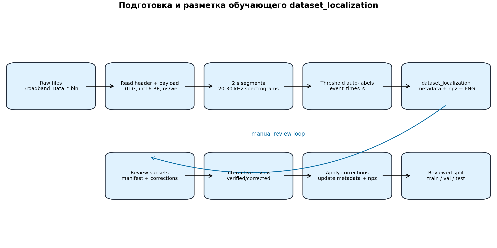
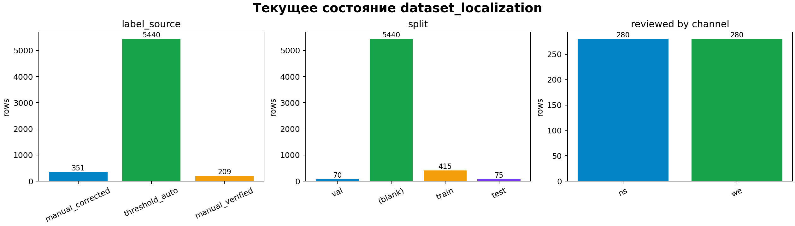
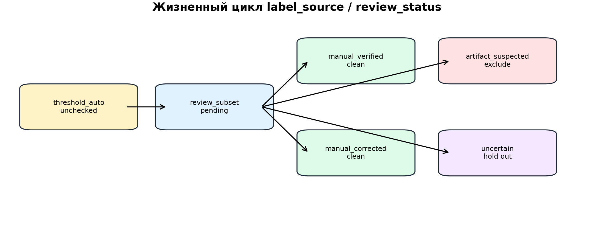
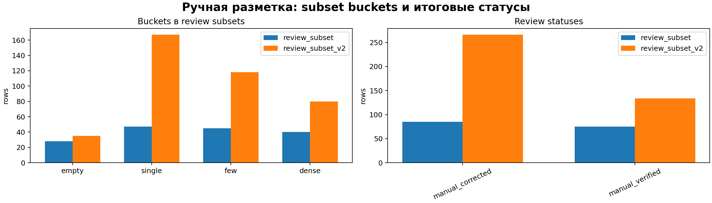

# Подготовка и разметка обучающего датасета

## 1. Назначение

Этот документ описывает, как в ветке `feature/2d-sferics-localization` подготавливался обучающий датасет для задачи:

```text
spec_db -> 2D CNN -> temporal heatmap -> времена сфериков
```

Главная цель подготовки датасета - получить не просто картинки спектрограмм, а связанный набор:

- `.npz` tensors для обучения;
- `metadata.csv` с путями, каналами, временем сегмента и label metadata;
- review PNG для ручной проверки;
- corrections CSV для ручной разметки;
- train/val/test split только для проверенных примеров.

Общая схема:



## 2. Исходные данные

Исходные данные - бинарные файлы:

```text
Broadband_Data_*.bin
```

Они читаются базовыми signal-processing функциями:

```text
plot_broadband_spectrogram.py
```

Кратко:

- файл проверяется по сигнатуре `DTLG`;
- payload читается как big-endian `int16`;
- извлекаются каналы `ns` и `we`;
- частота дискретизации на канал по умолчанию `100000 Hz`;
- запись режется на неперекрывающиеся 2-секундные сегменты.

Подробнее это описано в:

```text
docs/BASIC_SIGNAL_PROCESSING_RU.md
```

## 3. Сбор `dataset_localization`

Основной скрипт:

```text
build_localization_dataset.py
```

Команда сборки:

```bash
python3 build_localization_dataset.py /home/s_grudinin/code/university/vlf_analyzing/raw_vlf_data/raw_data \
  --channel both \
  --recursive \
  --freq-min 20000 \
  --freq-max 30000 \
  --segment-duration 2 \
  --time-resolution 0.002 \
  --frequency-resolution 50 \
  --overwrite
```

Смысл параметров:

- `--channel both` - собрать отдельно `ns` и `we`;
- `--recursive` - искать raw-файлы во вложенных директориях;
- `--freq-min 20000`, `--freq-max 30000` - использовать полосу `20-30 kHz`;
- `--segment-duration 2` - один sample равен 2 секундам;
- `--time-resolution 0.002` - шаг временной оси около `2 ms`;
- `--frequency-resolution 50` - частотный шаг около `50 Hz`;
- `--overwrite` - пересобрать выходную директорию.

Текущий результат:

- `6000` сегментов всего;
- `3000` сегментов `ns`;
- `3000` сегментов `we`;
- `100` минутных исходных файлов;
- каждый минутный файл дает `30` сегментов на канал.

Текущее состояние датасета:



## 4. Структура директории

После сборки создается:

```text
dataset_localization/
  metadata.csv
  samples/
    loc_0000000.npz
    loc_0000001.npz
    ...
  review/
    auto/
      ns/
      we/
    verified/
      ns/
      we/
    corrected/
      ns/
      we/
```

Назначение:

- `samples/` - compressed `.npz` tensors;
- `review/auto/` - PNG со спектрограммами и первичной auto-разметкой;
- `review/verified/` - PNG для примеров, где auto-label принят;
- `review/corrected/` - PNG для примеров, где ручная разметка изменила события;
- `metadata.csv` - центральная таблица датасета.

## 5. Что хранится в `.npz`

Каждый sample сохраняется как:

```text
dataset_localization/samples/loc_XXXXXXX.npz
```

Поля:

- `spec_db` - спектрограмма в dB;
- `envelope_db` - band-power envelope в dB;
- `time_axis` - временная ось внутри 2-секундного сегмента;
- `freq_axis` - частотная ось в Hz;
- `source_file` - исходный `.bin`;
- `channel` - `ns` или `we`;
- `segment_start` - начало сегмента в исходном файле;
- `segment_end` - конец сегмента;
- `event_times_s` - времена событий внутри сегмента;
- `event_count` - число событий;
- `target_heatmap` - целевая heatmap для CNN;
- `label_source` - источник разметки;
- `quality_flag` - качество/статус пригодности.

Для обучения 2D CNN используются:

```text
input  = spec_db
target = target_heatmap
```

## 6. `metadata.csv`

`metadata.csv` хранит одну строку на один сегмент.

Основные поля:

- `sample_id`;
- `source_file`;
- `channel`;
- `segment_index`;
- `segment_start`;
- `segment_end`;
- `sample_rate`;
- `time_resolution`;
- `frequency_resolution`;
- `freq_min`;
- `freq_max`;
- `npz_path`;
- `png_path`;
- `event_count`;
- `event_times_s_json`;
- `split`;
- `label_source`;
- `quality_flag`.

Изначально все строки получают:

```text
label_source = threshold_auto
quality_flag = unchecked
split = ""
```

Это означает: события найдены автоматически пороговым детектором и еще не подтверждены человеком.

## 7. Первичная разметка пороговым детектором

При сборке датасета для каждого 2-секундного сегмента применяется пороговый детектор.

Схема:

```text
segment samples
  -> STFT power
  -> crop 20-30 kHz
  -> aggregate power по частоте
  -> envelope_db
  -> robust threshold = median + K * MAD
  -> local peaks
  -> event_times_s
```

В `build_localization_dataset.py` используются функции из:

```text
detect_broadband_bursts.py
```

Ключевые параметры:

- `--aggregate mean`;
- `--threshold-mad 8`;
- `--min-peak-distance 0.01`;
- `--smooth-bins 3`.

Подробное описание detector logic:

```text
docs/THRESHOLD_DETECTOR_RU.md
```

Важно: `threshold_auto` - это weak label, а не финальная истина.

## 8. Построение `target_heatmap`

Нейросеть обучается не напрямую на списке времен, а на heatmap.

Для каждого события:

```text
event_time = t0
```

строится Gaussian peak:

```python
gaussian = exp(-0.5 * ((time_axis_s - event_time) / sigma_s) ** 2)
```

По умолчанию:

```text
heatmap_sigma = 0.01 s
```

Если событий несколько, heatmap собирается как максимум по всем Gaussian peaks:

```python
heatmap = maximum(heatmap, gaussian)
```

Если событий нет, `target_heatmap` остается нулевой.

## 9. Review subset v1

Проверять все `6000` сегментов вручную сразу неудобно, поэтому был собран stratified subset.

Скрипт:

```text
build_localization_review_subset.py
```

Команда:

```bash
python3 build_localization_review_subset.py dataset_localization
```

По умолчанию выбирается:

- `80` примеров на канал;
- всего `160` примеров.

Buckets:

- `empty` - `event_count = 0`;
- `single` - `event_count = 1`;
- `few` - `event_count = 2..3`;
- `dense` - `event_count > 3`.

Скрипт копирует PNG в структуру:

```text
dataset_localization/review_subset/
  manifest.csv
  ns/
    empty/
    single/
    few/
    dense/
  we/
    empty/
    single/
    few/
    dense/
```

`manifest.csv` содержит:

- `sample_id`;
- `channel`;
- `bucket`;
- `review_reason`;
- `event_count`;
- `source_file`;
- `segment_start`;
- `segment_end`;
- `png_path`;
- `npz_path`.

## 10. Corrections template

Для ручной проверки создается CSV-шаблон:

```bash
python3 init_localization_corrections.py dataset_localization/review_subset
```

Файл:

```text
dataset_localization/review_subset/corrections.csv
```

Поля:

- `sample_id`;
- `auto_event_count`;
- `auto_event_times_s_json`;
- `review_status`;
- `corrected_event_times_s_json`;
- `quality_flag`;
- `comment`.

Смысл:

- auto-поля показывают, что нашел threshold detector;
- `review_status` заполняется вручную;
- `corrected_event_times_s_json` хранит исправленные времена;
- `quality_flag` позволяет исключать артефактные/спорные примеры.

## 11. Интерактивная ручная разметка

Для удобной проверки был создан matplotlib-интерфейс:

```bash
python3 review_localization_interactive.py dataset_localization
```

На графике:

- спектрограмма сегмента;
- белые линии - auto-detected события;
- красные линии - выбранные человеком события.

Горячие клавиши:

- клик мышью - добавить событие;
- `v` - принять auto-label как `manual_verified`;
- `enter` или `c` - сохранить клики как `manual_corrected`;
- `backspace` - удалить последний клик;
- `r` - вернуть auto-label;
- `x` - очистить события;
- `a` - пометить `artifact_suspected`;
- `u` - пометить `uncertain`;
- `s` - пропустить;
- `q` - выйти.

Жизненный цикл статусов:



## 12. Применение corrections

После ручной проверки corrections применяются командой:

```bash
python3 apply_localization_corrections.py dataset_localization
```

Сначала можно проверить без записи:

```bash
python3 apply_localization_corrections.py dataset_localization --dry-run
```

Что делает apply:

1. читает `metadata.csv`;
2. читает `corrections.csv`;
3. для строк с `review_status` определяет финальные `event_times_s`;
4. обновляет `event_count`;
5. обновляет `event_times_s_json`;
6. обновляет `label_source`;
7. обновляет `quality_flag`;
8. пересобирает `target_heatmap`;
9. перезаписывает соответствующий `.npz`;
10. копирует PNG в `review/verified` или `review/corrected`;
11. создает backup metadata перед записью.

Правила:

- `manual_verified` - использовать auto-event times;
- `manual_corrected` - использовать `corrected_event_times_s_json`;
- `artifact_suspected` - пометить как артефакт;
- `uncertain` - пометить как спорный.

## 13. Итог v1

После первой ручной проверки:

- `160/160` строк проверены;
- `85 manual_corrected`;
- `75 manual_verified`;
- оба канала сбалансированы:
  - `80 ns`;
  - `80 we`.

Эти `160` строк стали первым gold-like subset для baseline обучения.

## 14. Первый train/val/test split

После появления reviewed labels был добавлен split:

```bash
python3 split_localization_reviewed.py dataset_localization
```

Правило:

> split назначается только reviewed rows, а `threshold_auto` остается без split.

Еще одно важное правило:

> все сегменты из одного `source_file` должны попасть в один и тот же split.

Это защищает от data leakage: соседние сегменты из одного минутного файла не должны одновременно попадать в train и test.

## 15. Active review subset v2

После первого обучения стало понятно, что полезно добрать больше ручной разметки.

Скрипт:

```text
build_localization_active_review_subset.py
```

Команды:

```bash
python3 build_localization_active_review_subset.py dataset_localization --overwrite
python3 init_localization_corrections.py dataset_localization/review_subset_v2
```

Отличие от v1:

- выбираются только unreviewed rows;
- учитываются prediction CSV модели, если они есть;
- повышается приоритет source_file/channel, где модель ошибалась;
- повышается приоритет `we`;
- повышается приоритет `few` и `dense`;
- сохраняется покрытие `empty` и `single`.

Параметры по умолчанию:

- `200` примеров на канал;
- `400` всего;
- `35 empty`;
- `45 single`;
- `55 few`;
- `65 dense` на канал как целевая квота, с fill-логикой при нехватке.

Фактический v2 subset:

- `400` строк;
- `200 ns`;
- `200 we`;
- buckets:
  - `35 empty`;
  - `167 single`;
  - `118 few`;
  - `80 dense`.

Распределения review subsets:



## 16. Итог v2 и общий reviewed dataset

После интерактивной проверки v2:

- `400/400` строк проверены;
- `266 manual_corrected`;
- `134 manual_verified`.

После применения v2 corrections:

```bash
python3 apply_localization_corrections.py dataset_localization \
  --corrections dataset_localization/review_subset_v2/corrections.csv
```

Общий итог:

- `560` reviewed строк;
- `351 manual_corrected`;
- `209 manual_verified`;
- `5440 threshold_auto`;
- `280 ns`;
- `280 we`.

После повторного split:

- `train`: `415`;
- `val`: `70`;
- `test`: `75`.

## 17. Какие строки используются для обучения

Модель обучается только на строках, где:

```text
label_source in {manual_verified, manual_corrected}
quality_flag = clean
split in {train, val, test}
```

Это реализовано в:

```python
load_reviewed_metadata(dataset_dir)
```

Строки `threshold_auto` не используются как supervised labels для текущего обучения.

Причина:

- они полезны как initial labels;
- но содержат ошибки;
- после ручной проверки более надежными считаются `manual_verified` и `manual_corrected`.

## 18. Проверка прогресса review

Для контроля был добавлен summary CLI:

```bash
python3 summarize_localization_review.py dataset_localization
```

Для v2:

```bash
python3 summarize_localization_review.py dataset_localization \
  --review-subset-dir dataset_localization/review_subset_v2
```

Он показывает:

- total rows;
- reviewed;
- pending;
- complete percent;
- распределение по `review_status`;
- распределение по channel;
- распределение по bucket;
- распределение по `quality_flag`;
- следующие pending examples.

## 19. Почему разметка устроена в два этапа

Полная ручная разметка всех `6000` сегментов слишком дорогая.

Поэтому используется staged workflow:

```text
1. threshold detector размечает все автоматически
2. человек проверяет небольшой сбалансированный subset
3. обучается baseline модель
4. модель показывает слабые места
5. active review добирает более полезные примеры
6. модель переобучается
7. качество проверяется на новых raw-файлах
```

Преимущество:

- быстрее получить первый рабочий model baseline;
- ручное время тратится на информативные примеры;
- dataset можно расширять итеративно;
- сохраняется воспроизводимость каждого шага.

## 20. Качество и статусы

Основные статусы:

- `threshold_auto` - автоматическая первичная разметка;
- `manual_verified` - человек подтвердил auto-label;
- `manual_corrected` - человек исправил времена;
- `artifact_suspected` - пример подозрителен/артефактный;
- `uncertain` - спорный пример.

Основные quality flags:

- `unchecked` - еще не проверено;
- `clean` - можно использовать для обучения;
- `artifact_suspected` - не использовать как clean sample;
- `uncertain` - не использовать как clean sample без отдельного решения.

Для обучения текущей CNN берутся только `clean`.

## 21. Типичные решения при ручной разметке

Если auto-label совпадает с видимыми сфериками:

```text
нажать v
```

Если auto-label пропустил сферик или поставил лишнее:

```text
кликнуть правильные времена -> enter/c
```

Если событий нет, а detector что-то поставил:

```text
очистить x -> enter/c
```

Если изображение артефактное:

```text
a
```

Если случай спорный:

```text
u
```

## 22. Связь с обучением CNN

После подготовки reviewed split обучение работает так:

```text
metadata.csv
  -> выбрать reviewed clean rows
  -> загрузить spec_db из npz
  -> загрузить target_heatmap из npz
  -> train/val/test по split
  -> обучить CNN
```

Если пользователь исправил времена через corrections, то `target_heatmap` тоже пересобирается. Поэтому CNN обучается уже на ручной версии временных событий.

## 23. Связь с верификацией модели

Подготовка обучающего датасета и верификация модели - разные процессы.

Training dataset:

```text
dataset_localization
review_subset
review_subset_v2
manual_verified/manual_corrected
```

Verification dataset:

```text
новые raw-файлы
model predictions
interactive verification
verification summary
```

Для верификации создан отдельный workflow:

```bash
python3 methods/2d_cnn_localization/verify_sferics_localization_2d_interactive.py <new_raw_dir> \
  --channel both
```

Он нужен, чтобы оценить уже обученную модель на данных, которые не использовались при training split.

## 24. Воспроизводимость

Важные артефакты, позволяющие восстановить состояние датасета:

- `dataset_localization/metadata.csv`;
- `dataset_localization/review_subset/manifest.csv`;
- `dataset_localization/review_subset/corrections.csv`;
- `dataset_localization/review_subset_v2/manifest.csv`;
- `dataset_localization/review_subset_v2/corrections.csv`;
- `dataset_localization/samples/*.npz`;
- `AGENT_STATUS.md`;
- `AGENT_HANDOFF.md`.

Рекомендуется после каждого milestone:

1. применить corrections;
2. проверить summary;
3. пересобрать split;
4. запустить py_compile;
5. обновить `AGENT_STATUS.md`;
6. сделать небольшой commit.

## 25. Ограничения текущего датасета

Текущий dataset уже полезен, но не финален.

Ограничения:

- reviewed только `560` из `6000` сегментов;
- `threshold_auto` все еще составляет большую часть dataset;
- ручная разметка могла иметь субъективные решения в слабых/плотных местах;
- `we` может быть более активным и шумным;
- split сгруппирован по source_file, но raw-файлы могут быть похожи между собой по условиям записи;
- верификация на новых raw-файлах еще важна для честной оценки.

## 26. Следующие шаги

Рекомендуемая последовательность:

1. Подготовить новый raw-набор для независимой проверки.
2. Прогнать модель на raw:

```bash
python3 methods/2d_cnn_localization/run_sferics_localization_2d.py <new_raw_dir> \
  --channel both \
  --save-plots
```

3. Интерактивно проверить предсказания:

```bash
python3 methods/2d_cnn_localization/verify_sferics_localization_2d_interactive.py <new_raw_dir> \
  --channel both
```

4. Собрать verification metrics:

```bash
python3 methods/2d_cnn_localization/summarize_sferics_localization_verification.py \
  --save-plots
```

5. Если видны систематические ошибки, собрать `review_subset_v3`.
6. Применить corrections.
7. Пересобрать split.
8. Переобучить CNN.

## 27. Краткое резюме

Подготовка обучающего датасета устроена как итеративный human-in-the-loop pipeline:

```text
raw files
  -> threshold_auto dataset
  -> balanced review subset
  -> interactive manual corrections
  -> reviewed clean labels
  -> source-file grouped train/val/test split
  -> CNN training
  -> active review expansion
```

Главная идея: пороговый detector дает быстрый старт, но финальное обучение должно опираться на ручную проверку. Поэтому `threshold_auto` используется как weak label, а `manual_verified` и `manual_corrected` становятся основой supervised training.
