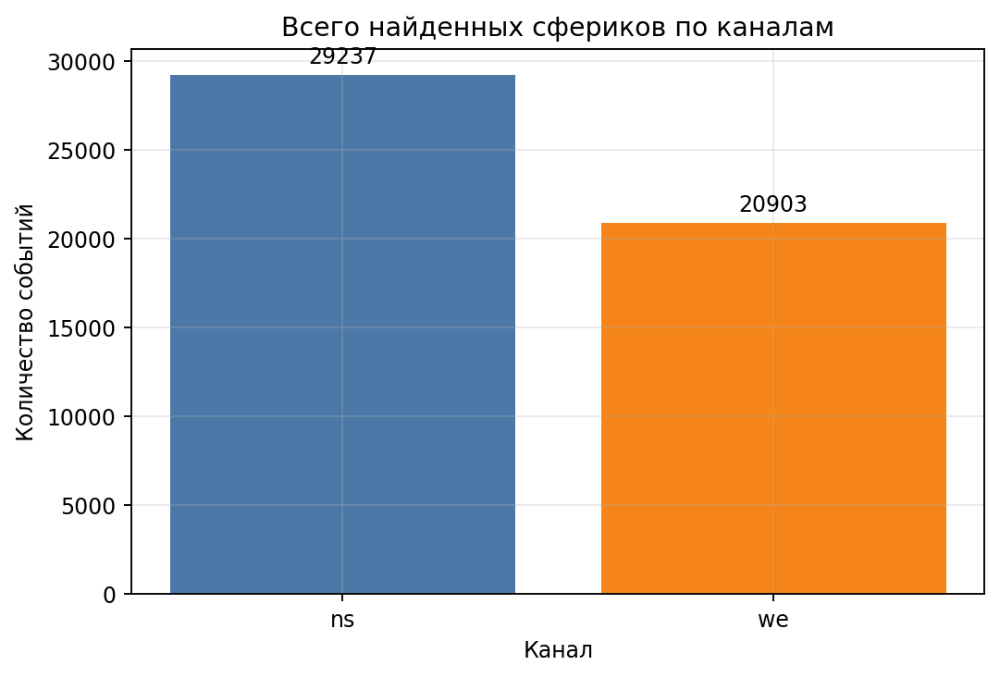
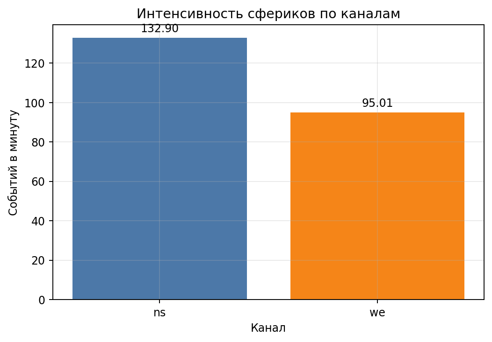
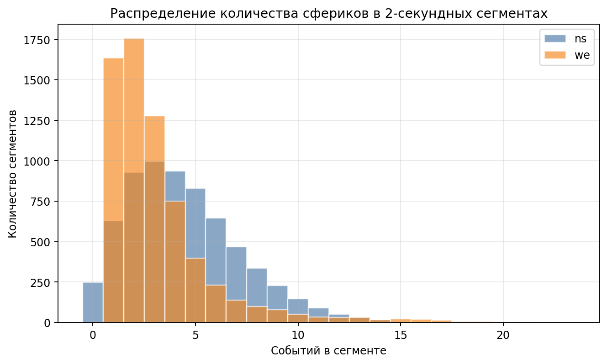
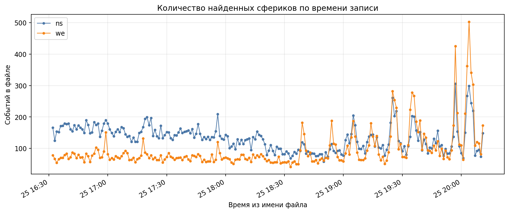
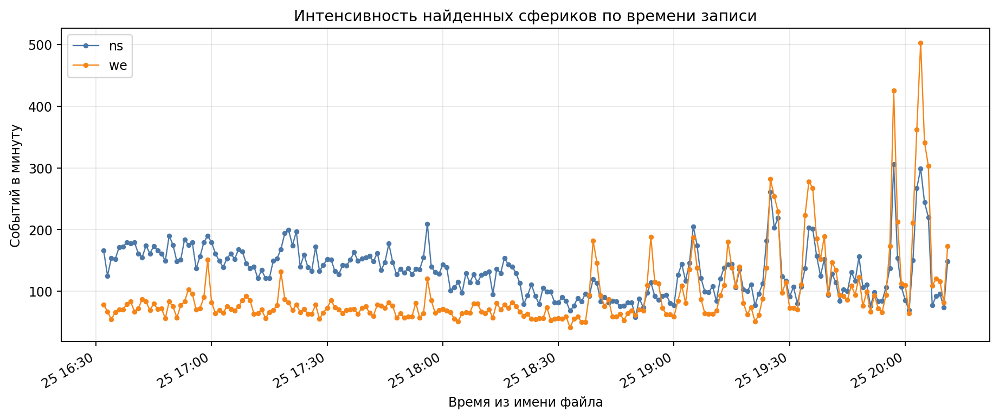
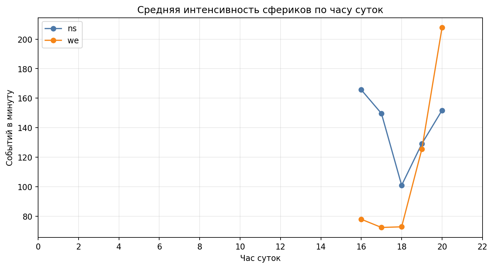
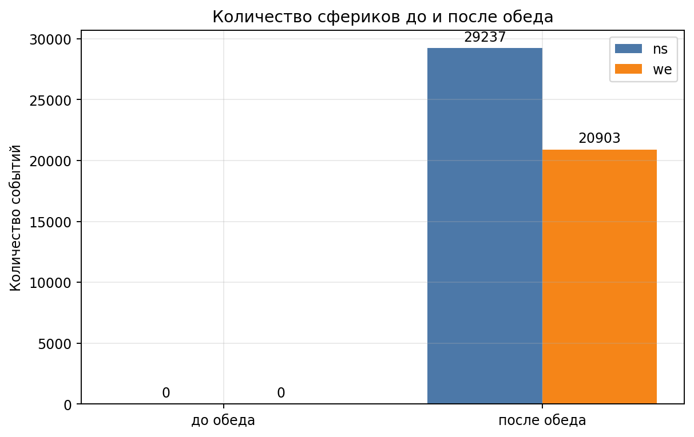
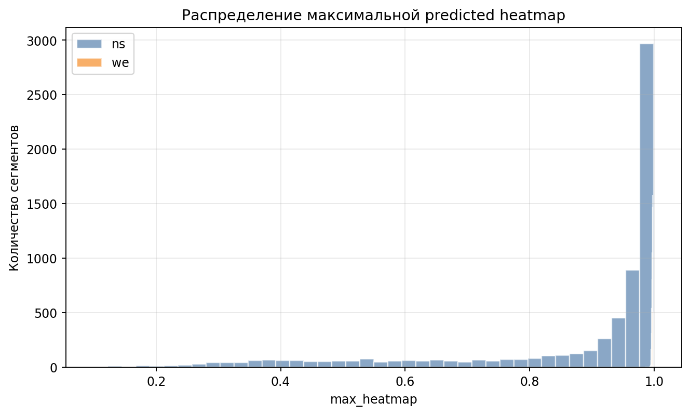

# Статистика 2D CNN по всем сырым данным `raw_vlf_data`

## Исходные данные и параметры

Прогон выполнен по всем файлам:

```text
/home/s_grudinin/code/university/vlf_analyzing/raw_vlf_data
```

Модель:

```text
methods/2d_cnn_localization/models/sferics_localization_2d.pt
```

Параметры инференса:

| Параметр | Значение |
|---|---:|
| Количество raw-файлов | 220 |
| Количество обработанных сегментов | 13200 |
| Длина сегмента | 2.0 с |
| Каналы | `ns`, `we` |
| Частотная полоса | 20000-30000 Hz |
| `peak_threshold` | 0.35 |
| `min_peak_distance` | 0.03 с |

## Общая статистика

| Канал | Сегменты | Найдено сфериков | Среднее на сегмент | Медиана на сегмент | Максимум на сегмент | Интенсивность, событий/мин |
|---|---:|---:|---:|---:|---:|---:|
| `ns` | 6600 | 29237 | 4.43 | 4.00 | 16 | 132.90 |
| `we` | 6600 | 20903 | 3.17 | 2.00 | 23 | 95.01 |
| Всего | 13200 | 50140 | 3.80 | - | 23 | 113.95 |

Главный результат:

```text
Всего модель нашла 50140 сфериков.
На канале ns найдено больше событий, чем на we.
```





## Распределение числа сфериков по сегментам

Гистограмма показывает, сколько событий модель находит в каждом 2-секундном сегменте.



Вывод:

- `ns` чаще содержит больше событий на сегмент;
- у `we` медиана ниже, но встречаются отдельные сегменты с большим числом событий;
- максимальное число событий в одном сегменте: `16` для `ns`, `23` для `we`.

## Статистика по времени записи

Время записи извлекалось из имени файла:

```text
Broadband_Data_YYYY.MM.DD_HH.MM.SS.bin
```

Количество найденных сфериков по времени:



Интенсивность по времени:



Вывод:

- на `ns` высокая активность видна почти на всём интервале;
- на `we` интенсивность заметно возрастает ближе к 19-20 часам;
- по графику интенсивности удобно искать интервалы повышенной активности для дальнейшего ручного анализа.

## Статистика по часам

| Час | Канал | Сегменты | События | Событий/мин |
|---:|---|---:|---:|---:|
| 16 | `ns` | 840 | 4639 | 165.68 |
| 16 | `we` | 840 | 2181 | 77.89 |
| 17 | `ns` | 1800 | 8977 | 149.62 |
| 17 | `we` | 1800 | 4339 | 72.32 |
| 18 | `ns` | 1800 | 6055 | 100.92 |
| 18 | `we` | 1800 | 4365 | 72.75 |
| 19 | `ns` | 1800 | 7745 | 129.08 |
| 19 | `we` | 1800 | 7524 | 125.40 |
| 20 | `ns` | 360 | 1821 | 151.75 |
| 20 | `we` | 360 | 2494 | 207.83 |



Вывод:

- максимальная средняя интенсивность `ns` наблюдается в 16 часов: `165.68` событий/мин;
- максимальная средняя интенсивность `we` наблюдается в 20 часов: `207.83` событий/мин;
- в 19-20 часов канал `we` становится гораздо активнее относительно более ранних часов.

## До обеда и после обеда

В данном наборе все файлы имеют время после полудня.

| Период | Канал | Сегменты | События | Событий/мин |
|---|---|---:|---:|---:|
| До обеда | `ns` | 0 | 0 | 0.00 |
| До обеда | `we` | 0 | 0 | 0.00 |
| После обеда | `ns` | 6600 | 29237 | 132.90 |
| После обеда | `we` | 6600 | 20903 | 95.01 |




Вывод:

```text
Сравнить активность до и после обеда на этом наборе нельзя,
так как утренних файлов в raw_vlf_data нет.
```

Для полноценного сравнения нужны raw-файлы с временем до 12:00.

## Статистика интенсивности

В этом отчёте интенсивность считается как:

```text
интенсивность = количество найденных событий / длительность наблюдения в минутах
```

Также сохранены признаки уверенности модели:

- `max_heatmap` - максимальное значение predicted heatmap в сегменте;
- `mean_heatmap` - среднее значение predicted heatmap в сегменте.

Распределение максимальной predicted heatmap:



Интерпретация:

- высокие значения `max_heatmap` соответствуют сегментам, где модель видит сильный пик события;
- распределение `max_heatmap` можно использовать как вспомогательную статистику уверенности модели;
- основная физически интерпретируемая интенсивность всё же считается в событиях в минуту.

## Выходные файлы

Основные таблицы:

```text
predictions/full_raw_2d_cnn_predictions.csv
events_by_file_channel.csv
events_by_hour_channel.csv
events_by_time_of_day_channel.csv
full_raw_2d_cnn_summary.json
```

Графики:

```text
plots/total_events_by_channel.png
plots/events_per_minute_by_channel.png
plots/events_per_segment_histogram_by_channel.png
plots/events_over_file_time_by_channel.png
plots/intensity_over_file_time_by_channel.png
plots/events_before_after_noon_by_channel.png
plots/intensity_before_after_noon_by_channel.png
plots/intensity_by_hour_channel.png
plots/max_heatmap_histogram_by_channel.png
```

## Итоговый вывод

Модель 2D CNN была применена ко всем `220` raw-файлам из `raw_vlf_data`. Всего обработано `13200` двухсекундных сегментов и найдено `50140` сфериков.

Основные наблюдения:

- канал `ns` содержит больше найденных событий: `29237` против `20903` на `we`;
- средняя интенсивность `ns`: `132.90` событий/мин;
- средняя интенсивность `we`: `95.01` событий/мин;
- все файлы относятся к периоду после полудня;
- по часам активность `we` заметно возрастает к 19-20 часам;
- для корректного сравнения "до обеда / после обеда" нужно добавить утренние raw-файлы.

