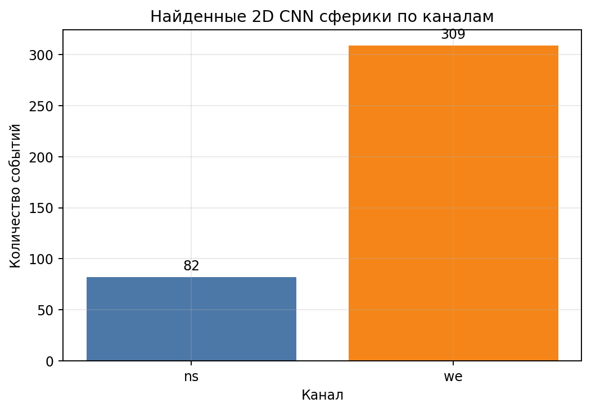
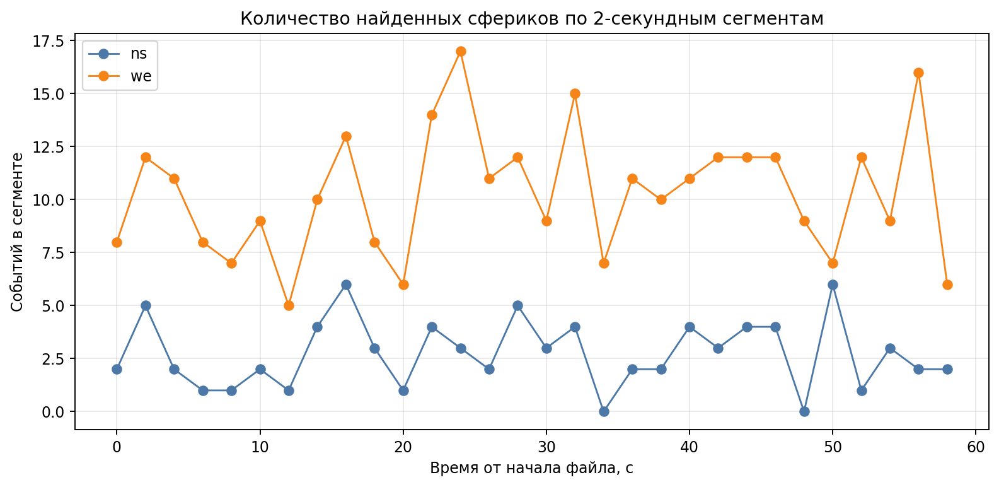
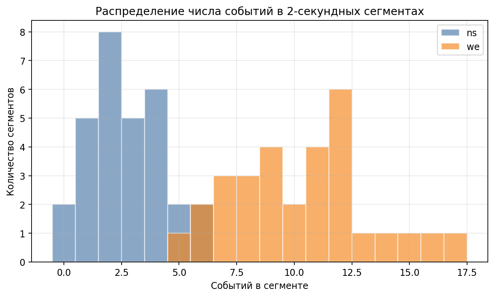
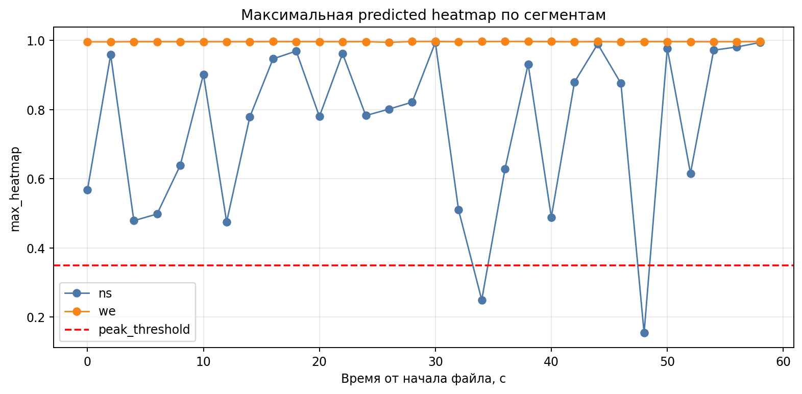

# Статистика 2D CNN для Broadband_Data_2026.06.02_13.51.00

Файл:

```text
/home/s_grudinin/code/university/vlf_analyzing/new_test_raw_data/Broadband_Data_2026.06.02_13.51.00.bin
```

Модель:

```text
methods/2d_cnn_localization/models/sferics_localization_2d.pt
```

Параметры:

| Параметр | Значение |
|---|---:|
| Длина сегмента | 2.0 с |
| Частотная полоса | 20000-30000 Hz |
| Каналы | ns, we |
| `peak_threshold` | 0.35 |
| `min_peak_distance` | 0.03 с |
| Всего сегментов | 60 |

## Общая статистика

| Канал | Сегменты | Найдено сфериков | Среднее на сегмент | Максимум на сегмент |
|---|---:|---:|---:|---:|
| `ns` | 30 | 82 | 2.73 | 6 |
| `we` | 30 | 309 | 10.30 | 17 |

Всего найдено:

```text
391 событий
```



## Динамика по времени внутри файла



График показывает число событий в каждом 2-секундном сегменте. Канал `we` на этом файле значительно активнее канала `ns`.

## Распределение событий по сегментам



## Уверенность модели / max heatmap



`max_heatmap` показывает максимальное значение predicted heatmap в сегменте. Красная линия соответствует `peak_threshold`.

## Выходные файлы

```text
raw_inference/sferics_localization_2d_raw_predictions.csv
raw_inference/sferics_localization_2d_raw_summary.json
events_by_segment_channel.csv
plots/
```
